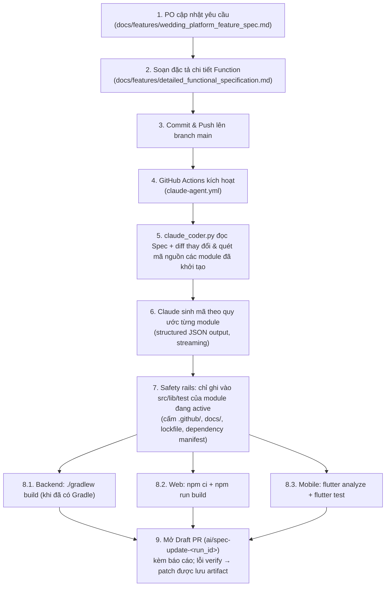

# 💍 Wedding Event & Studio Management Monorepo Platform

Hệ sinh thái ứng dụng quản lý sự kiện cưới và vận hành studio ảnh cưới toàn diện, kết hợp giữa ứng dụng di động cho Cặp đôi/Freelancer và Cổng thông tin Web SaaS cho Studio quản lý. Dự án được xây dựng theo kiến trúc **Monorepo** và tích hợp quy trình **Agentic Coding CI/CD** (tự động chuyển đổi tài liệu đặc tả của PO thành mã nguồn bằng Claude AI của Anthropic).

---

## 🏛️ 1. Cấu Trúc Monorepo

```
wedding-event/
├── backend-common/              # Java 21 / Spring Boot 4 - Entities, DTOs, Repositories dùng chung
├── admin-console/               # Hệ thống Quản trị Vận hành Studio (Lumière Studios)
│   ├── backend/                 # Java Spring Boot 4 - RESTful API quản lý Studio (RBAC Admin/Staff)
│   └── frontend/                # React 18 + TypeScript + Tailwind CSS - Web Dashboard Studio
├── client-console/              # Hệ thống Dịch vụ Khách hàng (WedPlanner)
│   ├── backend/                 # Java Spring Boot 4 - RESTful API & WebSocket cho Cặp đôi & Vendor
│   └── mobile/                  # Flutter 3 (Dart) - Ứng dụng di động đa nền tảng (iOS & Android)
├── docs/                        # Tài liệu hệ thống & Thiết kế
│   ├── architecture/            # Kiến trúc hệ thống, Luồng dữ liệu & Hạ tầng Docker
│   │   └── system_architecture_and_infrastructure.md
│   ├── features/                # Đặc tả chức năng (Source of Truth cho Claude Agent)
│   │   ├── wedding_platform_feature_spec.md      # Tài liệu tổng quan (Dành cho PO)
│   │   └── detailed_functional_specification.md  # Đặc tả kỹ thuật chi tiết từng function (AI Coder)
│   └── templates/               # Bản mẫu giao diện tham chiếu (React & Mobile UI)
└── .github/                     # Tự động hóa CI/CD
    ├── actions/verify-monorepo/ # Composite action: build & test mọi module đã khởi tạo (dùng chung)
    ├── workflows/
    │   ├── ci.yml               # Verify cho PR/push của người (web build, flutter analyze + test, gradle)
    │   └── claude-agent.yml     # Sinh mã từ spec → verify → mở Draft PR
    └── scripts/
        └── claude_coder.py      # Agent Claude: đọc spec + diff, sinh mã trong phạm vi cho phép
```

---

## 🛠️ 2. Công Nghệ Sử Dụng (Tech Stack)

| Phân hệ | Công nghệ chính |
| :--- | :--- |
| **Backend Core** | Java 21, Spring Boot 4.x, Spring Data JPA, Spring Security, Hibernate |
| **Database** | PostgreSQL / MySQL, Redis (Cache & Session) |
| **Admin Web Portal** | React 18, TypeScript, Tailwind CSS, Lucide React, Vite |
| **Client Mobile App** | Flutter 3.x, Dart, Firebase Cloud Messaging, WebSocket STOMP |
| **AI & Automation** | Custom In-House AI Model (FastAPI/PyTorch - Runtime), Claude Opus 5.5 - Anthropic API (CI/CD Agentic Code Gen), GitHub Actions |

---

## 🚀 3. Quy Trình Phát Triển Tự Động Hóa (AI Agentic Workflow)

Hệ thống ứng dụng mô hình **Spec-Driven Development** kết hợp với **Claude Opus 5.5**:



**Lưu ý:**
* Module chỉ được agent sinh mã khi đã "khởi tạo" (có `package.json` / `pubspec.yaml` / `settings.gradle` ở root). Backend hiện **chưa** có Gradle nên bị bỏ qua và CI cảnh báo rõ ràng.
* Có thể chạy tay: *Actions → Claude Spec-to-Code Agent → Run workflow* (chọn spec và `targets`: `web,mobile,backend`).
* PR do agent tạo bằng `GITHUB_TOKEN` không kích hoạt `ci.yml` (giới hạn của GitHub) — vì vậy agent tự chạy cùng bộ verify trước khi mở PR.

### Quy trình 2 tầng tài liệu:
1. **Tài liệu Tổng quan (`docs/features/wedding_platform_feature_spec.md`)**: Nơi Product Owner (PO) cập nhật ý tưởng, thêm bớt luồng nghiệp vụ hoặc điều chỉnh UX tổng thể.
2. **Tài liệu Chi tiết Kỹ thuật (`docs/features/detailed_functional_specification.md`)**: Chuyển đổi yêu cầu của PO thành hợp đồng kỹ thuật nghiêm ngặt: Input/Output Schema, quy tắc validation, công thức tính toán và mã lỗi. Script AI sẽ ưu tiên đọc tài liệu này để sinh code chuẩn xác 100%.

---

## 📱 4. Các Tính Năng Trọng Tâm

### A. Ứng dụng Di động WedPlanner (Cặp đôi & Freelancer)
* **Kế hoạch Cưới & Ngân sách**: Đếm ngược ngày cưới, phân bổ ngân sách theo từng danh mục, theo dõi tỷ lệ chi tiêu thực tế.
* **Trợ lý AI Wedding Planner**: Tích hợp Custom In-House AI Model (Mô hình AI tự huấn luyện chuyên sâu cho ngành cưới) tư vấn phong cách cưới và tự động lập kế hoạch/ngân sách phù hợp.
* **Đồng bộ Bạn đời (Couple Sync)**: Tạo mã kết nối 6 ký tự để hai người cùng quản lý chung một kế hoạch cưới.
* **Quản lý Khách mời (RSVP)**: Phân nhóm họ hàng, bạn bè, theo dõi phản hồi tham gia theo thời gian thực.
* **Không gian Đối tác (Vendor Hub)**: Quản lý dự án chụp/quay, báo giá và trao đổi trực tiếp với khách hàng.

### B. Cổng Quản trị Studio Lumière (Admin Web SaaS)
* **Executive Dashboard**: Chỉ số KPI doanh thu tháng, hợp đồng đang chạy, phễu khách hàng tiềm năng.
* **Lịch trình Thông minh**: Xem lịch chụp, thử váy theo Ngày / Tuần / Tháng, thuật toán chống trùng lịch nhân sự.
* **CRM & Xuất Hợp Đồng A4**: Quản lý phễu bán hàng Kanban 5 bước; xuất file PDF hợp đồng A4 chuẩn in ấn và chia sẻ qua Zalo.
* **Kho & Bộ Đệm Bảo Dưỡng (Maintenance Buffer)**: Quản lý váy cưới, vest, máy ảnh; cơ chế tự động khóa ngày giặt hấp sau khi khách trả trang phục.
* **Kế toán Thu Chi**: Sổ quỹ theo dõi dòng tiền, tự động cập nhật tiền cọc và công nợ hợp đồng.

---

## ⚙️ 5. Cài Đặt & Chạy Thử Nghiệm

### Yêu cầu hệ thống:
* **Java**: OpenJDK 21 (Temurin)
* **Node.js**: Phiên bản 20+ & npm
* **Flutter SDK**: Phiên bản 3.24+ (kênh stable)
* **Python**: Phiên bản 3.10+ (cho AI Agent Script)

### Cài đặt nhanh từng phân hệ:

#### 1. Backend Admin (Java 21 + Spring Boot 4)
```bash
docker compose -f docker-compose.dev.yml up -d   # PostgreSQL 16 cho môi trường dev
./gradlew build                                   # compile + integration tests (Testcontainers, cần Docker)
./gradlew :admin-console:backend:bootRun          # API http://localhost:8082 + dữ liệu demo
```
Chi tiết API, tài khoản demo và biến môi trường: [admin-console/backend/README.md](admin-console/backend/README.md).

#### 2. Web Admin (React + TypeScript)
```bash
cd admin-console/frontend
npm ci
npm run dev     # demo với mock API (không cần backend)
npm run dev:api # dùng API thật của admin-console/backend qua Vite proxy
npm run build   # tsc --noEmit + vite build (giống CI)
```

#### 3. Kiểm tra Mobile App (Flutter)
```bash
cd client-console/mobile
flutter create . --platforms=android,ios   # lần đầu: sinh thư mục nền tảng
flutter pub get
flutter analyze && flutter test            # giống CI
```

#### 4. Chạy thử AI Coder Agent nội bộ
```bash
pip install "anthropic>=1.11,<2"
python .github/scripts/claude_coder.py --print-prompt   # xem context gửi đi, không gọi API
export ANTHROPIC_API_KEY="your-anthropic-api-key"
python .github/scripts/claude_coder.py --dry-run --targets web   # gọi model, không ghi file
python .github/scripts/claude_coder.py --report report.md        # ghi file + báo cáo
```

---

## 🔐 6. Cấu Hình GitHub Actions & Secrets

Để quy trình tự động mở Pull Request hoạt động trên GitHub Repository:
1. **Thêm Secret**: Vào `Settings > Secrets and variables > Actions`, thêm `ANTHROPIC_API_KEY` với API key lấy từ Claude Console (platform.claude.com).
2. **Cấp quyền Workflow**: Vào `Settings > Actions > General > Workflow permissions`:
   * Chọn **"Read and write permissions"**.
   * Đánh dấu tích vào **"Allow GitHub Actions to create and approve pull requests"**.
3. **Biến tùy chọn** (`Settings > Secrets and variables > Actions > Variables`):
   * `CLAUDE_MODEL` — mặc định `claude-opus-5-5`.
   * `CLAUDE_EFFORT` — `low` / `medium` / `high` / `xhigh` / `max` (mặc định `high`; cao hơn = kỹ hơn nhưng tốn token hơn).
   * `ALLOW_DEPENDENCY_CHANGES` — `true` để agent được sửa `package.json` / `pubspec.yaml` / `build.gradle` (mặc định `false`).

---

## 📚 7. Danh Mục Tài Liệu Kỹ Thuật (Documentation Index)

* 🏛️ [Tài liệu Kiến trúc Hệ thống, Thiết kế & Hạ tầng Docker](docs/architecture/system_architecture_and_infrastructure.md) - Chi tiết luồng dữ liệu, topology mạng, cấu hình Docker Compose & Nginx.
* 📋 [Tài liệu Đặc tả Tính năng Tổng quan (PO Spec)](docs/features/wedding_platform_feature_spec.md) - Hướng dẫn nghiệp vụ, user stories và cấu trúc Monorepo.
* ⚙️ [Tài liệu Đặc tả Kỹ thuật Chi tiết (Detailed Function Spec)](docs/features/detailed_functional_specification.md) - Đặc tả input/output JSON schema, validation, mã lỗi và thuật toán cho từng function.