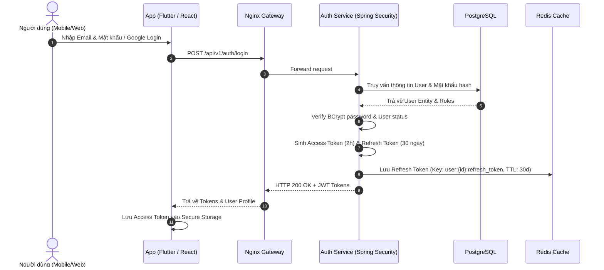
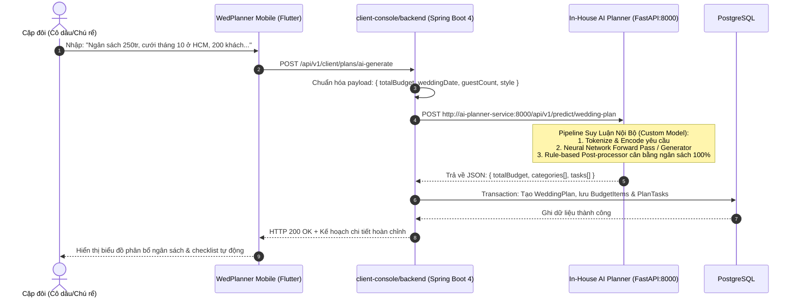
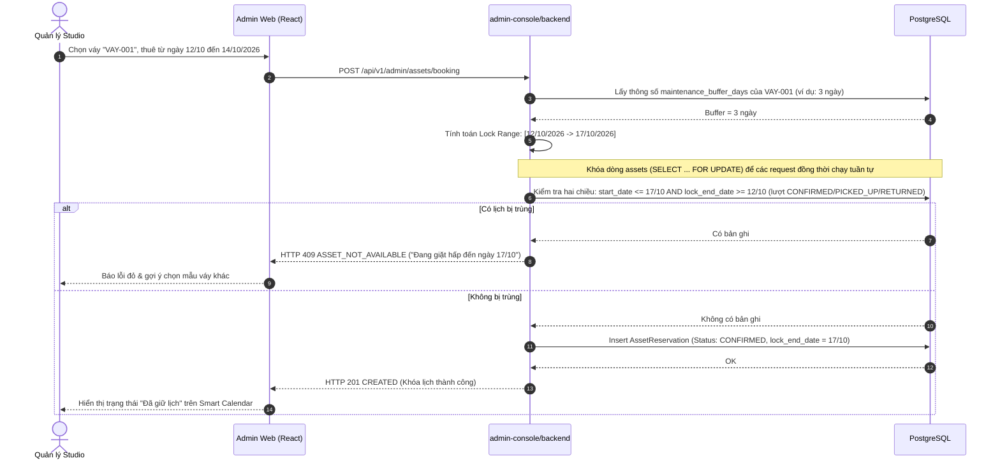
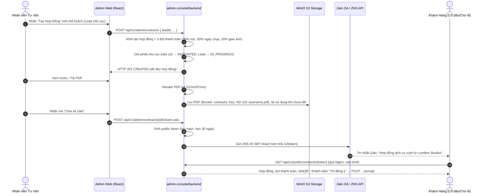

# 🏛️ KIẾN TRÚC HỆ THỐNG, THIẾT KẾ VÀ HẠ TẦNG (SYSTEM ARCHITECTURE & INFRASTRUCTURE DESIGN)

**Dự án:** Wedding Event & Studio Management Monorepo Platform  
**Phiên bản:** 1.0.0  
**Tài liệu:** System Architecture, Data Flow, and Docker Infrastructure Specification  

---

## 1. TỔNG QUAN THIẾT KẾ HỆ THỐNG (SYSTEM OVERVIEW)

Hệ thống được thiết kế theo mô hình **Modular Monorepo**, phân tách ranh giới rõ ràng (Separation of Concerns) giữa tầng giao diện người dùng, tầng dịch vụ backend nghiệp vụ, và tầng dữ liệu dùng chung.

### 1.1. Sơ đồ Kiến trúc Tổng thể (High-Level Architecture Diagram)

```mermaid
graph TB
    subgraph Clients["TẦNG CLIENT (NGƯỜI DÙNG & VẬN HÀNH)"]
        MobileApp["📱 WedPlanner Mobile App<br/>(Flutter 3 / Dart)<br/>iOS & Android (Couple & Vendor)"]
        AdminWeb["💻 Lumière Studios Web Portal<br/>(React 18 + TS + Tailwind)<br/>Studio Manager & Staff"]
    end

    subgraph Gateway["TẦNG REVERSE PROXY & GATEWAY"]
        NginxProxy["🌐 Nginx Ingress / Reverse Proxy<br/>SSL Termination, Rate Limit, Routing"]
    end

    subgraph BackendServices["TẦNG ỨNG DỤNG BACKEND (SPRING BOOT 4 / JAVA 21)"]
        ClientBE["🚀 client-console/backend<br/>Port: 8081<br/>- Couple Hub & AI Planner<br/>- Guest & RSVP Service<br/>- In-App Chat (WebSocket STOMP)"]
        AdminBE["💼 admin-console/backend<br/>Port: 8082<br/>- Executive CRM & Pipeline<br/>- Smart Booking & Staff Dispatch<br/>- A4 Contract & PDF Generator<br/>- Asset & Maintenance Buffer"]
        CommonCore["📦 backend-common<br/>- JPA Entities & DTOs<br/>- Repositories & Base Services<br/>- Security & Common Utilities"]
    end

    subgraph DataStorage["TẦNG DỮ LIỆU & HẠ TẦNG LƯU TRỮ"]
        PostgresDB[("🐘 PostgreSQL 16<br/>Relational Database<br/>Port: 5432")]
        RedisCache[("⚡ Redis 7.2<br/>Distributed Cache, Session<br/>WebSocket Pub/Sub Broker<br/>Port: 6379")]
        MinioS3[("🪣 MinIO Object Storage<br/>S3-Compatible Storage<br/>Photos, Contracts PDF<br/>Port: 9000/9001")]
    end

    subgraph AIServices["TẦNG AI NỘI BỘ (CUSTOM IN-HOUSE AI SERVICE)"]
        CustomAI["🧠 In-House AI Planner Service<br/>(Custom Trained Model / FastAPI)<br/>Port: 8000 (Internal)<br/>Wedding NLP & Budget Engine"]
    end

    subgraph ExternalServices["DỊCH VỤ NGOÀI (EXTERNAL SERVICES)"]
        FCM["🔔 Firebase Cloud Messaging<br/>Push Notifications"]
        ZaloAPI["💬 Zalo Notification Service (ZNS)<br/>OA Contract Sharing Webhook"]
    end

    %% Connections
    MobileApp -->|HTTPS / WSS| NginxProxy
    AdminWeb -->|HTTPS| NginxProxy

    NginxProxy -->|/api/v1/auth/**, /api/v1/users/**, /api/v1/client/**, /api/v1/messages/**, /ws/**| ClientBE
    NginxProxy -->|/api/v1/admin/** (gồm /admin/auth/**), /api/v1/public/**| AdminBE

    ClientBE -.->|Compile & Runtime Dependency| CommonCore
    AdminBE -.->|Compile & Runtime Dependency| CommonCore

    ClientBE -->|Read / Write| PostgresDB
    AdminBE -->|Read / Write| PostgresDB

    ClientBE -->|Cache & Pub/Sub| RedisCache
    AdminBE -->|Cache & Session| RedisCache

    ClientBE -->|Upload/Download Media| MinioS3
    AdminBE -->|Store/Retrieve Contract PDF| MinioS3

    ClientBE -->|HTTP REST: Predict Plan| CustomAI
    ClientBE -->|Send Push Notification| FCM
    AdminBE -->|Send Contract Link| ZaloAPI
```

---

## 2. PHÂN TÁCH VAI TRÒ VÀ TRÁCH NHIỆM TỪNG MODULE (MODULE BREAKDOWN)

### 2.1. `backend-common` (Java 21 / Spring Boot 4 Core Library)
* **Bản chất**: Thư viện nội bộ dạng JAR dependency, không chạy độc lập như một web server.
* **Trách nhiệm**:
  * Định nghĩa toàn bộ **JPA Entities** dùng chung (`User`, `WeddingPlan`, `BudgetItem`, `Guest`, `ServicePackage`, `Booking`, `Contract`, `Asset`, `PaymentTransaction`).
  * Khai báo các **Enums** hệ thống (`Role`, `BookingStatus`, `ContractStatus`, `AssetStatus`, v.v.).
  * Chứa **Spring Data JPA Repositories** gốc và các Custom Query.
  * Cung cấp các **Base DTOs**, Response Wrapper (`ApiResponse<T>`), và Global Exception Handling classes (`AppException`, `ResourceNotFoundException`).
  * Chứa các thuật toán dùng chung: Mã hóa, định dạng tiền tệ VND, helper tính toán ngày tháng.

### 2.2. `client-console/backend` (Spring Boot 4 Service - Port 8081)
* **Trách nhiệm**:
  * Phục vụ toàn bộ traffic từ ứng dụng di động của Cặp đôi và Freelancer/Vendor.
  * Quản lý Onboarding, đăng nhập Google OAuth2, xác thực mã OTP qua email/SMS.
  * Tích hợp **Custom AI Planner Service** (Mô hình AI chuyên biệt do dự án tự huấn luyện, giao tiếp qua REST API nội bộ) để cung cấp tính năng Trợ lý AI Wedding Planner (sinh ngân sách, gợi ý checklist).
  * Xử lý kết nối bạn đời (Couple Collaboration Sync) qua cơ chế Pairing Code.
  * Máy chủ **WebSocket STOMP** hỗ trợ nhắn tin trực tiếp (1-1 Chat) giữa Cặp đôi và Studio/Vendor, sử dụng Redis Pub/Sub làm message broker.

### 2.3. `admin-console/backend` (Spring Boot 4 Service - Port 8082)
* **Trách nhiệm**:
  * Phục vụ cổng quản trị nghiệp vụ nội bộ của Studio Lumière.
  * Cung cấp API báo cáo KPI điều hành (Doanh thu tháng, hợp đồng, leads, tỉ lệ cho thuê váy).
  * Quản lý Lịch trình thông minh (Smart Booking Calendar) kèm thuật toán phát hiện xung đột lịch làm việc của thợ chụp/quay/makeup.
  * CRM phễu khách hàng Kanban 5 giai đoạn.
  * **Contract Engine**: Tạo hợp đồng điện tử, tự động render mã HTML/PDF khổ in A4 tiêu chuẩn (iText / OpenHTMLtoPDF) và bắn Webhook chia sẻ qua Zalo OA.
  * Quản lý kho trang phục (Váy cưới, Vest) và thiết bị máy ảnh kèm **Thuật toán Khóa Bộ đệm Bảo dưỡng (Maintenance Buffer)**.
  * Kế toán thu chi (Financial Transactions ledger) và quản lý công nợ khách hàng.

### 2.4. `admin-console/frontend` (React 18 + TS + Tailwind CSS)
* **Bản chất**: Single Page Application (SPA), được build thành các static files (HTML, JS, CSS) và serve qua Nginx Container trên production.
* **Trách nhiệm**:
  * Giao diện SaaS chuyên nghiệp, hỗ trợ phân quyền hiển thị theo Role (`ROLE_ADMIN` vs `ROLE_STAFF`).
  * Tích hợp thanh tìm kiếm toàn cầu (Global Search Ctrl+K), chuông thông báo real-time.
  * Modal xem trước và xuất in Hợp đồng A4 trực quan.

### 2.5. `client-console/mobile` (Flutter 3 + Dart)
* **Bản chất**: Ứng dụng di động native đa nền tảng (iOS & Android).
* **Trách nhiệm**:
  * Trải nghiệm mượt mà 60fps/120fps cho cặp đôi và thợ chụp.
  * Tích hợp Local Storage (Hive / SharedPreferences) để cache dữ liệu kế hoạch cưới offline.
  * Lắng nghe Push Notification từ Firebase Cloud Messaging (FCM) và thông báo qua Local Notifications.

### 2.6. `ai-planner-service` (Python / FastAPI / Custom AI Model - Port 8000)
* **Bản chất**: AI Microservice nội bộ phục vụ suy luận (inference) cho mô hình trí tuệ nhân tạo chuyên biệt về sự kiện cưới (Domain-specific Wedding Planning Model) do đội ngũ tự huấn luyện (Custom Fine-tuned/Trained Model).
* **Trách nhiệm**:
  * Nhận input: Tổng ngân sách dự kiến, thời gian cưới, địa điểm, số khách mời, phong cách tiệc cưới.
  * Thực thi pipeline suy luận qua PyTorch / ONNX Runtime / HuggingFace Transformers với checkpoint model đã được huấn luyện riêng.
  * Xác thực và trả về JSON có cấu trúc nghiêm ngặt (Pydantic Schema): Bảng phân bổ chi phí chi tiết theo danh mục và danh sách to-do checklist theo tháng.
  * Đảm bảo thời gian phản hồi cực nhanh (Low Latency), độc lập hoàn toàn với API bên thứ 3 và bảo mật dữ liệu tuyệt đối trong mạng Docker nội bộ.

---

## 3. LUỒNG DỮ LIỆU CHI TIẾT (DETAILED DATA FLOWS)

### 3.1. Luồng Xác Thực Người Dùng (Authentication & Token Lifecycle Flow)



---

### 3.2. Luồng Lập Kế Hoạch Cưới Bằng AI (AI-Powered Wedding Plan Generation Flow)

Hệ thống sử dụng **Custom In-House AI Model** chuyên biệt về cưới hỏi (được huấn luyện và triển khai nội bộ dưới dạng microservice FastAPI, không phụ thuộc vào API LLM bên ngoài):



---

### 3.3. Luồng Quản Lý Thuê Trang Phục & Bộ Đệm Bảo Dưỡng (Wardrobe Booking & Maintenance Buffer)



---

### 3.4. Luồng Tạo & Xuất Hợp Đồng Điện Tử Khổ A4 (Contract Generation & Zalo Sharing)



---

## 4. THIẾT KẾ HẠ TẦNG VỚI DOCKER (DOCKER INFRASTRUCTURE)

Toàn bộ hệ thống được container hóa (containerized) bằng Docker và điều phối qua **Docker Compose** trên môi trường Local Development cũng như Production VPS.

### 4.1. Kiến trúc Container & Mạng Nội bộ (Docker Network Topology)

```
[ Internet / Public Clients ]
              │
              ▼ :80, :443
┌─────────────────────────────────────────────────────────────┐
│                      nginx-gateway                          │
│               (Reverse Proxy & SSL Router)                  │
└──────────────┬───────────────────────────────┬──────────────┘
               │                               │
               ▼ :80                           ▼ :8081 / :8082
┌───────────────────────────────┐ ┌───────────────────────────┐
│     admin-frontend            │ │      backend-services     │
│ (React build / Nginx Static)  │ │  ┌─────────────────────┐  │
│ Container Port: 80            │ │  │ client-backend:8081 │  │
└───────────────────────────────┘ │  ├─────────────────────┤  │
                                  │  │ admin-backend:8082  │  │
                                  │  ├─────────────────────┤  │
                                  │  │ ai-planner:8000     │  │
                                  │  │ (Custom AI Model)   │  │
                                  │  └─────────────────────┘  │
                                  └─────────────┬─────────────┘
                                                │
                 ┌──────────────────────────────┴──────────────────────────────┐
                 ▼ :5432                        ▼ :6379                        ▼ :9000
┌───────────────────────────────┐ ┌───────────────────────────┐ ┌───────────────────────────┐
│          postgres-db          │ │        redis-cache        │ │       minio-storage         │
│         PostgreSQL 16         │ │         Redis 7.2         │ │     S3-Compatible Store     │
│   Volume: postgres_data       │ │    Volume: redis_data     │ │     Volume: minio_data      │
└───────────────────────────────┘ └───────────────────────────┘ └───────────────────────────┘
```

---

### 4.2. File `docker-compose.yml` Chuẩn Mẫu

Dưới đây là cấu hình Docker Compose hoàn chỉnh sẵn sàng triển khai:

```yaml
version: '3.8'

networks:
  wedding-net:
    driver: bridge

volumes:
  postgres_data:
  redis_data:
  minio_data:

services:
  # --- 1. RELATIONAL DATABASE (POSTGRESQL 16) ---
  postgres-db:
    image: postgres:16-alpine
    container_name: wedding_postgres
    restart: unless-stopped
    environment:
      POSTGRES_DB: wedding_db
      POSTGRES_USER: wedding_admin
      POSTGRES_PASSWORD: SecretPassword123!
    ports:
      - "5432:5432"
    volumes:
      - postgres_data:/var/lib/postgresql/data
    networks:
      - wedding-net
    healthcheck:
      test: ["CMD-SHELL", "pg_isready -U wedding_admin -d wedding_db"]
      interval: 10s
      timeout: 5s
      retries: 5

  # --- 2. DISTRIBUTED CACHE & MESSAGE BROKER (REDIS 7) ---
  redis-cache:
    image: redis:7.2-alpine
    container_name: wedding_redis
    restart: unless-stopped
    command: redis-server --requirepass RedisSecretPass123!
    ports:
      - "6379:6379"
    volumes:
      - redis_data:/data
    networks:
      - wedding-net
    healthcheck:
      test: ["CMD", "redis-cli", "-a", "RedisSecretPass123!", "ping"]
      interval: 10s
      timeout: 5s
      retries: 5

  # --- 3. S3-COMPATIBLE OBJECT STORAGE (MINIO) ---
  minio-storage:
    image: minio/minio:RELEASE.2024-01-18T22-51-28Z
    container_name: wedding_minio
    restart: unless-stopped
    command: server /data --console-address ":9001"
    environment:
      MINIO_ROOT_USER: minio_admin
      MINIO_ROOT_PASSWORD: MinioSecretPass123!
    ports:
      - "9000:9000"
      - "9001:9001"
    volumes:
      - minio_data:/data
    networks:
      - wedding-net

  # --- 4. IN-HOUSE AI PLANNER SERVICE (CUSTOM TRAINED MODEL) ---
  ai-planner-service:
    build:
      context: ./ai-services/planner-service
      dockerfile: Dockerfile
    image: wedding_ai_planner:latest
    container_name: wedding_ai_planner
    restart: unless-stopped
    environment:
      PORT: 8000
      MODEL_PATH: /app/models/custom_wedding_planner.pt
      DEVICE: cpu # hoặc cuda nếu có GPU
    volumes:
      - ./models:/app/models:ro # Mount checkpoint mô hình tự huấn luyện
    networks:
      - wedding-net
    healthcheck:
      test: ["CMD", "curl", "-f", "http://localhost:8000/health"]
      interval: 15s
      timeout: 5s
      retries: 3

  # --- 5. CLIENT BACKEND (SPRING BOOT 4 - PORT 8081) ---
  client-backend:
    build:
      context: .
      dockerfile: client-console/backend/Dockerfile
    container_name: wedding_client_be
    restart: unless-stopped
    depends_on:
      postgres-db:
        condition: service_healthy
      redis-cache:
        condition: service_healthy
      ai-planner-service:
        condition: service_healthy
    environment:
      SERVER_PORT: 8081
      SPRING_DATASOURCE_URL: jdbc:postgresql://postgres-db:5432/wedding_db
      SPRING_DATASOURCE_USERNAME: wedding_admin
      SPRING_DATASOURCE_PASSWORD: SecretPassword123!
      SPRING_REDIS_HOST: redis-cache
      SPRING_REDIS_PORT: 6379
      SPRING_REDIS_PASSWORD: RedisSecretPass123!
      AI_PLANNER_SERVICE_URL: http://ai-planner-service:8000
    networks:
      - wedding-net

  # --- 5. ADMIN BACKEND (SPRING BOOT 4 - PORT 8082) ---
  admin-backend:
    build:
      context: .
      dockerfile: admin-console/backend/Dockerfile
    container_name: wedding_admin_be
    restart: unless-stopped
    depends_on:
      postgres-db:
        condition: service_healthy
      redis-cache:
        condition: service_healthy
    environment:
      SERVER_PORT: 8082
      SPRING_DATASOURCE_URL: jdbc:postgresql://postgres-db:5432/wedding_db
      SPRING_DATASOURCE_USERNAME: wedding_admin
      SPRING_DATASOURCE_PASSWORD: SecretPassword123!
      SPRING_REDIS_HOST: redis-cache
      SPRING_REDIS_PORT: 6379
      SPRING_REDIS_PASSWORD: RedisSecretPass123!
      MINIO_ENDPOINT: http://minio-storage:9000
      MINIO_ACCESS_KEY: minio_admin
      MINIO_SECRET_KEY: MinioSecretPass123!
    networks:
      - wedding-net

  # --- 6. ADMIN FRONTEND (REACT 18 + TS - SERVED VIA NGINX) ---
  admin-frontend:
    build:
      context: admin-console/frontend
      dockerfile: Dockerfile
    container_name: wedding_admin_fe
    restart: unless-stopped
    networks:
      - wedding-net

  # --- 7. REVERSE PROXY & GATEWAY (NGINX) ---
  nginx-gateway:
    image: nginx:1.25-alpine
    container_name: wedding_gateway
    restart: unless-stopped
    ports:
      - "80:80"
      - "443:443"
    volumes:
      - ./nginx/nginx.conf:/etc/nginx/nginx.conf:ro
    depends_on:
      - admin-frontend
      - client-backend
      - admin-backend
    networks:
      - wedding-net
```

---

### 4.3. Cấu hình Nginx Gateway Routing (`nginx.conf`)

Nginx đóng vai trò là cửa ngõ duy nhất (Single Point of Entry) định tuyến lưu lượng truy cập:

```nginx
events { worker_connections 1024; }

http {
    include /etc/nginx/mime.types;
    sendfile on;

    # Giới hạn tần suất theo IP: đăng nhập admin & trang hợp đồng công khai
    limit_req_zone $binary_remote_addr zone=login:10m rate=20r/m;
    limit_req_zone $binary_remote_addr zone=public:10m rate=30r/m;
    limit_req_status 429;

    upstream client_backend_upstream {
        server client-backend:8081;
    }

    upstream admin_backend_upstream {
        server admin-backend:8082;
    }

    upstream admin_frontend_upstream {
        server admin-frontend:80;
    }

    server {
        listen 80;
        server_name localhost;

        # 1. Định tuyến API Khách hàng & Mobile App (gồm xác thực mobile /api/v1/auth/)
        location ~ ^/api/v1/(client|auth|users|messages)/ {
            proxy_pass http://client_backend_upstream;
            proxy_set_header Host $host;
            proxy_set_header X-Real-IP $remote_addr;
            proxy_set_header X-Forwarded-For $proxy_add_x_forwarded_for;
        }

        # 2. Định tuyến WebSocket STOMP Chat cho Mobile
        location /ws/ {
            proxy_pass http://client_backend_upstream;
            proxy_http_version 1.1;
            proxy_set_header Upgrade $http_upgrade;
            proxy_set_header Connection "Upgrade";
            proxy_set_header Host $host;
        }

        # 3. Định tuyến API Quản trị Studio Lumière (gồm xác thực admin /api/v1/admin/auth/)
        location /api/v1/admin/ {
            proxy_pass http://admin_backend_upstream;
            proxy_set_header Host $host;
            proxy_set_header X-Real-IP $remote_addr;
            proxy_set_header X-Forwarded-For $proxy_add_x_forwarded_for;
        }

        # 3b. Chống dò mật khẩu đăng nhập admin
        location = /api/v1/admin/auth/login {
            limit_req zone=login burst=5 nodelay;
            proxy_pass http://admin_backend_upstream;
            proxy_set_header Host $host;
            proxy_set_header X-Real-IP $remote_addr;
            proxy_set_header X-Forwarded-For $proxy_add_x_forwarded_for;
        }

        # 3c. API trang hợp đồng công khai cho khách (link Zalo /c/{token}) — không đăng nhập
        location /api/v1/public/ {
            limit_req zone=public burst=10 nodelay;
            proxy_pass http://admin_backend_upstream;
            proxy_set_header Host $host;
            proxy_set_header X-Real-IP $remote_addr;
            proxy_set_header X-Forwarded-For $proxy_add_x_forwarded_for;
            add_header Referrer-Policy no-referrer always;
        }

        # 4. Toàn bộ request còn lại chuyển về Web Admin Frontend (SPA)
        location / {
            proxy_pass http://admin_frontend_upstream;
            proxy_set_header Host $host;
            proxy_set_header X-Real-IP $remote_addr;
        }
    }
}
```

---

### 4.4. Dockerfile Mẫu Tối Ưu cho Spring Boot 4 (Multi-stage Build)

```dockerfile
# Stage 1: Build JAR bằng Gradle & Eclipse Temurin JDK 21
FROM eclipse-temurin:21-jdk-alpine AS builder
WORKDIR /workspace

# Copy gradle wrapper & build files trước để tận dụng Docker cache
COPY gradlew settings.gradle build.gradle ./
COPY gradle ./gradle
COPY backend-common ./backend-common
COPY client-console/backend ./client-console/backend

RUN chmod +x ./gradlew
RUN ./gradlew :client-console:backend:bootJar -x test --no-daemon

# Stage 2: Runtime Image tối giản chỉ chứa JRE 21
FROM eclipse-temurin:21-jre-alpine
WORKDIR /app

# Tạo non-root user vì lý do bảo mật
RUN addgroup -S appgroup && adduser -S appuser -G appgroup
USER appuser

COPY --from=builder /workspace/client-console/backend/build/libs/*.jar app.jar

ENV JAVA_OPTS="-XX:+UseZGC -XX:+ZGenerational -Xms256m -Xmx512m"
EXPOSE 8081

ENTRYPOINT ["sh", "-c", "java $JAVA_OPTS -jar app.jar"]
```

---

## 5. CHIẾN LƯỢC BẢO MẬT & ĐỘ TIN CẬY (SECURITY & RELIABILITY)

1. **Bảo mật Tầng mạng (Network Isolation):**
   * Chỉ duy nhất cổng `:80` và `:443` của Nginx Gateway được mở ra ngoài Internet.
   * Toàn bộ cơ sở dữ liệu PostgreSQL (`:5432`), Redis (`:6379`), MinIO (`:9000`) và các Backend Services nằm trọn vẹn trong mạng nội bộ ảo `wedding-net`.
2. **Quyền truy cập Cơ sở Dữ liệu (Least Privilege):**
   * Mỗi service backend sử dụng credential độc lập hoặc schema tách biệt trong PostgreSQL.
3. **Quản lý Concurrency cao bằng Java 21 Virtual Threads:**
   * Trong cấu hình Spring Boot 4: `spring.threads.virtual.enabled=true`.
   * Cho phép xử lý hàng chục nghìn kết nối đồng thời từ mobile client mà không lo cạn kiệt pool luồng của OS (Operating System Thread Pool exhaustion).
4. **Giám sát & Health Check:**
   * Tích hợp **Spring Boot Actuator** (`/actuator/health`, `/actuator/metrics`).
   * Docker tự động khởi động lại container (restart: unless-stopped) nếu health check trả về lỗi quá 5 lần liên tiếp.
