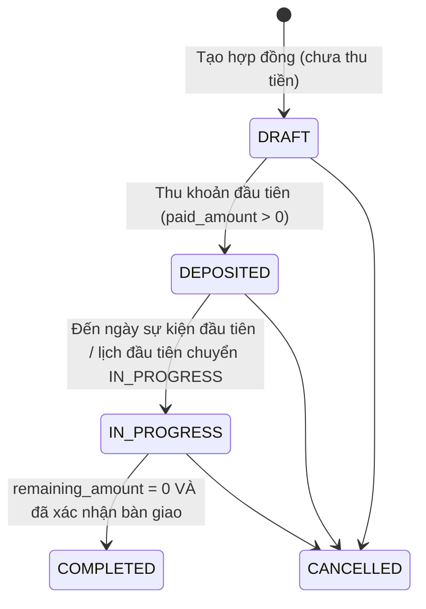

# TÀI LIỆU ĐẶC TẢ CHI TIẾT CHỨC NĂNG (DETAILED FUNCTIONAL SPECIFICATION)
**Dự án:** Wedding Event & Studio Management Monorepo Platform  
**Phiên bản:** 1.1.1  
**Mục tiêu:** Cung cấp thông số kỹ thuật, quy tắc nghiệp vụ (Business Rules), Schema Request/Response và quy trình xử lý chi tiết từng function cho AI Agent / Kỹ sư phần mềm triển khai mã nguồn chính xác 100%.

**Ký hiệu trạng thái triển khai** (gắn ở đầu mỗi function phía Admin):
* ✅ **Đã triển khai** — đã có trong `admin-console/backend` + `frontend`, spec này mô tả đúng hành vi hiện tại.
* ⚠️ **Thay đổi** — đã triển khai nhưng spec v1.1 thay đổi hành vi; phần thay đổi được đánh dấu *(v1.1)*.
* 🆕 **Mới** — chưa triển khai.

### Lịch sử thay đổi
| Phiên bản | Nội dung |
| :--- | :--- |
| 1.0.0 | Bản đầu tiên. |
| 1.1.0 | **Nhóm A — làm rõ spec:** vòng đời trạng thái Hợp đồng/Lịch hẹn/Lead (§1.6); xác thực Admin tách `/api/v1/admin/auth/**`, thu hồi token, đăng xuất (Module 5A); ma trận phân quyền (§1.5); danh mục mã lỗi (§1.3); công thức KPI chống chia cho 0; bộ đệm bảo dưỡng kiểm tra hai chiều; bổ sung các endpoint đã có nhưng chưa được đặc tả (gói dịch vụ, nhân sự, thông báo, tìm kiếm, cài đặt). **Nhóm B — tính năng mới:** UI giữ lịch trang phục, hành trình khách hàng liền mạch, lịch thanh toán 30/50/20 + nhắc nợ, sửa/hủy, quản lý tài khoản, trang hợp đồng công khai, tự phục vụ cho nhân viên, phân trang & điều hướng tìm kiếm, yêu cầu phi chức năng (§3). |
| 1.1.1 | Đối chiếu với mã nguồn: các mục chưa có trong code được gắn *(v1.1)* (JWT claim `typ`, kết quả tìm kiếm `contract`/`lead`, `completedThisMonth` tính đến hôm nay, địa chỉ Bên A); bổ sung endpoint mobile đang dùng nhưng chưa đặc tả (FN-AUTH-04, FN-PLAN-05, FN-SVC-02, FN-NOTI-01) và `budgetItems`/`tasks` trong FN-PLAN-02. |

---

## 1. QUY ƯỚC CHUNG (CONVENTIONS & STANDARDS)

### 1.1. Chuẩn dữ liệu
* Tiền tệ: `VND`, số nguyên không có phần thập phân (`NUMERIC(15,0)` trong DB, `BigDecimal` trên Backend, `number` trên Frontend). Khi chia tỉ lệ phần trăm, làm tròn `HALF_UP` về đồng; phần chênh lệch làm tròn dồn vào đợt/hạng mục cuối cùng để tổng luôn khớp.
* Ngày giờ: ISO 8601 (`YYYY-MM-DDTHH:mm:ssZ`), Ngày: `YYYY-MM-DD`, Giờ trong ngày: `HH:mm` (24h).
* Múi giờ nghiệp vụ: **`Asia/Ho_Chi_Minh`** — "hôm nay", "tháng này", hạn thanh toán, job nhắc nợ đều tính theo múi giờ này.
* ID: `UUIDv4` cho toàn bộ bảng. Mã nghiệp vụ hiển thị sinh từ PostgreSQL sequence: Nhân sự `NV-001`, Hợp đồng `HD-102`, Giao dịch `TRX-001`, Trang phục/Thiết bị nhập tay dạng `^[A-Z]{2,5}-\d{3,}$` (ví dụ `VAY-001`).
* Số điện thoại Việt Nam: `^(03|05|07|08|09)\d{8}$`.

### 1.2. Quy chuẩn phản hồi RESTful API
```json
// Thành công:
{
  "success": true,
  "code": "SUCCESS",
  "message": "Thao tác thành công",
  "data": { ... }
}
// Thất bại:
{
  "success": false,
  "code": "ERROR_CODE_NAME",
  "message": "Mô tả lỗi chi tiết cho người dùng (tiếng Việt)",
  "errors": [ { "field": "phone", "message": "Số điện thoại không hợp lệ" } ]
}
```
* `POST` tạo mới trả `201 Created`; các thao tác khác trả `200 OK`.
* **Phân trang** *(v1.1)* — áp dụng cho các endpoint danh sách có thể tăng không giới hạn (giao dịch, hợp đồng, khách hàng dạng danh sách, thông báo, tài khoản, nhật ký):
  * Query: `?page=0&size=20&sort=createdAt,desc` (`page` bắt đầu từ 0, `size` tối đa 100, mặc định 20).
  * `data`: `{ "items": [...], "page": 0, "size": 20, "totalElements": 135, "totalPages": 7 }`.
  * Không phân trang: Kanban CRM (giới hạn 200 thẻ/cột, thẻ cũ nhất bị ẩn kèm nút "Xem tất cả" chuyển sang dạng danh sách), lịch (`calendar` giới hạn bởi khoảng ngày), danh mục nhỏ (gói dịch vụ, nhân sự, kho).

### 1.3. Danh mục mã lỗi
**Mã chung:** `BAD_REQUEST` (400, kèm `errors[]` khi lỗi validation), `UNAUTHORIZED` (401), `FORBIDDEN` (403), `NOT_FOUND` (404), `METHOD_NOT_ALLOWED` (405), `CONFLICT` (409), `CONCURRENT_MODIFICATION` (409 — bản ghi đã bị người khác sửa, tải lại rồi thử lại), `TOO_MANY_REQUESTS` (429), `INTERNAL_SERVER_ERROR` (500).

**Mã nghiệp vụ phía Admin:**
| Mã | HTTP | Ngữ cảnh |
| :--- | :--- | :--- |
| `INVALID_CREDENTIALS` | 401 | Sai email **hoặc** mật khẩu (không phân biệt để tránh dò email). |
| `ACCOUNT_LOCKED` | 403 | Tài khoản bị vô hiệu hóa. |
| `TOO_MANY_ATTEMPTS` | 429 | Đăng nhập sai quá số lần cho phép (§5A). |
| `INVALID_REFRESH_TOKEN` | 401 | Refresh token sai, hết hạn hoặc đã bị thu hồi. |
| `PASSWORD_CHANGE_REQUIRED` | 403 | Tài khoản dùng mật khẩu tạm, phải đổi trước khi gọi API khác. |
| `WRONG_PASSWORD` | 400 | Mật khẩu hiện tại không đúng khi đổi mật khẩu. |
| `EMAIL_EXISTS` | 409 | Email tài khoản đã tồn tại. |
| `LAST_ADMIN` | 409 | Không thể hạ quyền/khóa quản lý cuối cùng. |
| `CANNOT_MODIFY_SELF` | 409 | Không tự khóa / tự hạ quyền chính mình. |
| `STAFF_NOT_FOUND` | 400 | Có nhân sự trong `staffIds` không tồn tại. |
| `STAFF_SCHEDULE_CONFLICT` | 409 | Nhân sự trùng lịch (kèm tên). |
| `INVALID_STATUS_TRANSITION` | 409 | Chuyển trạng thái không hợp lệ theo §1.6. |
| `ASSET_CODE_EXISTS` | 409 | Mã trang phục/thiết bị đã tồn tại. |
| `ASSET_NOT_AVAILABLE` | 409 | Trang phục vướng lịch thuê/bảo dưỡng. |
| `LEAD_HAS_CONTRACT` | 409 | Xóa khách hàng đã có hợp đồng. |
| `DEPOSIT_EXCEEDS_TOTAL` | 400 | Tiền cọc lớn hơn tổng giá trị hợp đồng. |
| `CONTRACT_LOCKED` | 409 | Sửa hợp đồng không còn ở trạng thái `DRAFT`. |
| `CONTRACT_NOT_PAYABLE` | 409 | Ghi thu vào hợp đồng `CANCELLED`/`COMPLETED`. |
| `PAYMENT_EXCEEDS_REMAINING` | 400 | Số tiền thu vượt công nợ còn lại. |
| `CONTRACT_NOT_PAID` | 409 | Xác nhận bàn giao khi còn công nợ. |
| `TRANSACTION_ALREADY_VOIDED` | 409 | Hủy phiếu thu/chi đã bị hủy. |
| `ZALO_NOT_AVAILABLE` | 400 | SĐT khách chưa đăng ký Zalo. |
| `SHARE_LINK_EXPIRED` | 410 | Link hợp đồng công khai hết hạn hoặc đã bị thu hồi. |

### 1.4. Định tuyến API qua Nginx Gateway *(v1.1)*
| Tiền tố | Service | Ghi chú |
| :--- | :--- | :--- |
| `/api/v1/auth/**`, `/api/v1/users/**`, `/api/v1/client/**`, `/api/v1/messages/**`, `/ws/**` | `client-console/backend` | Mobile (Couple/Vendor). |
| `/api/v1/admin/**` (gồm cả `/api/v1/admin/auth/**`) | `admin-console/backend` | Web Admin. Xác thực Admin **không** dùng `/api/v1/auth/**`. |
| `/api/v1/public/**` | `admin-console/backend` | Trang hợp đồng công khai cho khách (§FN-PUB-CONTR-01), không cần đăng nhập, có rate-limit. |
| `/` | `admin-console/frontend` | SPA, gồm route công khai `/c/{token}`. |

### 1.5. Ma trận phân quyền Web Admin (RBAC) *(v1.1)*
Quyền được thực thi ở **2 lớp**: (1) theo URL trong `SecurityFilterChain` — chạy *trước* khi parse/validate body nên nhân viên luôn nhận `403` thay vì `400`; (2) `@PreAuthorize` trên controller (phòng thủ chiều sâu). "Của mình" = bản ghi gắn với `users.staff_member_id` của người gọi.

| Chức năng | `ROLE_ADMIN` | `ROLE_STAFF` |
| :--- | :---: | :---: |
| Dashboard KPI, biểu đồ doanh thu | ✔ | ✖ (Dashboard nhân viên: lịch & việc hôm nay của mình) |
| Lịch: xem | ✔ toàn studio | ✔ chỉ lịch của mình (bỏ qua `staffId` truyền lên) |
| Lịch: tạo / sửa / hủy | ✔ | ✔ tạo; sửa/hủy ✖ |
| Lịch: cập nhật trạng thái thực hiện | ✔ | ✔ lịch của mình (§FN-ADM-CAL-04) |
| Gói dịch vụ: xem | ✔ | ✔ |
| Gói dịch vụ: tạo / sửa / bật-tắt | ✔ | ✖ |
| Kho: xem, tra cứu lịch trống, giữ lịch trang phục | ✔ | ✔ |
| Kho: nhập mới / sửa / đổi trạng thái thủ công / hủy giữ lịch | ✔ | ✖ (hủy giữ lịch do mình tạo: ✔) |
| Kho: giao / nhận trả trang phục | ✔ | ✔ |
| Nhân sự: xem danh sách | ✔ | ✔ |
| Nhân sự: tạo / sửa / đổi trạng thái; giao & quản lý công việc | ✔ | ✖ |
| Công việc của mình: xem, đánh dấu hoàn thành | ✔ | ✔ |
| CRM: xem, tạo, sửa, chuyển giai đoạn, ghi chú liên hệ | ✔ | ✔ |
| CRM: xóa khách hàng | ✔ | ✖ |
| Hợp đồng: xem, xem trước, tải PDF, chia sẻ Zalo | ✔ | ✔ |
| Hợp đồng: tạo / sửa / hủy / xác nhận bàn giao / thu hồi link | ✔ | ✖ |
| Sổ quỹ: xem, ghi thu/chi, hủy phiếu | ✔ | ✖ |
| Thông báo, Tìm kiếm toàn cục | ✔ | ✔ (kết quả lọc theo quyền xem) |
| Cài đặt studio: xem | ✔ | ✔ |
| Cài đặt studio: sửa; Quản lý tài khoản; Nhật ký hệ thống | ✔ | ✖ |
| Đổi mật khẩu của mình | ✔ | ✔ |

### 1.6. Vòng đời trạng thái (State Machines) *(v1.1)*
Mọi chuyển trạng thái ngoài các mũi tên dưới đây trả `409 INVALID_STATUS_TRANSITION`.

**Hợp đồng — `ContractStatus`: `DRAFT | DEPOSITED | IN_PROGRESS | COMPLETED | CANCELLED`**

* **`PAID_FULL` không phải trạng thái hợp đồng** (bản 1.0 dùng lẫn). Tình trạng thanh toán là thuộc tính dẫn xuất `paymentStatus`: `UNPAID` (paid = 0) | `PARTIAL` | `PAID_FULL` (remaining = 0) | `OVERDUE` (có đợt quá hạn chưa trả đủ — ưu tiên hiển thị hơn `PARTIAL`).
* Trả đủ tiền **không** tự hoàn tất hợp đồng *(v1.1 — bản hiện tại tự chuyển `COMPLETED` khi trả đủ)*: khách có thể trả 100% trước ngày chụp. `COMPLETED` chỉ đạt được khi trả đủ **và** quản lý xác nhận bàn giao (`POST /contracts/{id}/deliver`); nếu đã bàn giao trước rồi mới trả nốt, phiếu thu cuối tự chuyển `COMPLETED`.
* Hợp đồng `IN_PROGRESS` được tính là "đang chạy" trên Dashboard cùng với `DEPOSITED`.

**Lịch hẹn — `BookingStatus`: `UPCOMING | CONFIRMED | IN_PROGRESS | COMPLETED | CANCELLED`**
* `UPCOMING → CONFIRMED` (khách đã xác nhận) `→ IN_PROGRESS` (đang chụp/thử) `→ COMPLETED`. Cho phép nhảy `UPCOMING → IN_PROGRESS`.
* Mọi trạng thái trừ `COMPLETED` → `CANCELLED`. Lịch `CANCELLED`/`COMPLETED` không sửa được.

**Khách hàng CRM — `LeadStage`: `NEW_LEAD | IN_CONSULTATION | AWAITING_DEPOSIT | IN_PROGRESS | COMPLETED | LOST`**
* Kéo thả tự do giữa 3 cột đầu. `IN_PROGRESS`/`COMPLETED` do hệ thống đồng bộ từ hợp đồng (§FN-ADM-CRM-03); kéo tay vào 2 cột này chỉ được phép khi khách đã có hợp đồng.
* `LOST` *(v1.1)*: khách không chốt / hợp đồng bị hủy — không hiển thị thành cột Kanban, xem qua bộ lọc "Đã mất".

**Giữ lịch trang phục — `ReservationStatus`: `CONFIRMED | PICKED_UP | RETURNED | CANCELLED`** *(v1.1 thêm `PICKED_UP`, `RETURNED`)*
* `CONFIRMED → PICKED_UP` (khách nhận đồ) `→ RETURNED` (khách trả). `CONFIRMED → CANCELLED`.
* Đặt chỗ ở `CONFIRMED`/`PICKED_UP`/`RETURNED` (khi `lock_end_date >= hôm nay`) đều chiếm lịch khi kiểm tra trùng.

**Đợt thanh toán — `InstallmentStatus`: `PENDING | PARTIAL | PAID | OVERDUE | CANCELLED`** (xem §FN-ADM-FIN-02).

---

## PHẦN A: CLIENT & MOBILE APP FUNCTIONS (CẶP ĐÔI & FREELANCER)

### MODULE 1: AUTHENTICATION & ONBOARDING

#### `FN-AUTH-01: Đăng nhập bằng Email & Mật khẩu`
* **Mục tiêu:** Xác thực danh tính người dùng bằng email và mật khẩu.
* **Endpoint:** `POST /api/v1/auth/login`
* **Quyền truy cập:** Public
* **Input Schema:**
  ```json
  {
    "email": "ngoc.hoang@example.com",
    "password": "Password123@"
  }
  ```
* **Validation Rules:**
  * `email`: Bắt buộc, định dạng email chuẩn RFC 5322.
  * `password`: Bắt buộc, tối thiểu 6 ký tự.
* **Quy trình xử lý (Business Logic):**
  1. Tìm `email` trong bảng `users` (không phân biệt hoa thường). Nếu không có **hoặc** BCrypt kiểm tra mật khẩu không khớp -> trả về `401 INVALID_CREDENTIALS` với cùng một thông điệp *(v1.1 — bỏ `404 USER_NOT_FOUND` để không lộ email đã đăng ký)*.
  2. Kiểm tra trường `is_active`. Nếu `false` -> trả về `403 ACCOUNT_LOCKED`.
  3. Nếu tài khoản chưa xác thực OTP (`is_verified == false`), hệ thống sinh mã OTP mới và yêu cầu xác thực.
  4. Sinh cặp JWT Token (`accessToken` hạn 2 giờ, `refreshToken` hạn 30 ngày).
* **Output Schema (200 OK):**
  ```json
  {
    "success": true,
    "data": {
      "accessToken": "eyJhbGciOi...",
      "refreshToken": "eyJhbGciOi...",
      "user": {
        "id": "c1f2e3d4-...",
        "email": "ngoc.hoang@example.com",
        "fullName": "Ngọc & Hoàng",
        "role": "ROLE_COUPLE",
        "hasPlan": true,
        "isVerified": true
      }
    }
  }
  ```

#### `FN-AUTH-02: Xác thực mã OTP`
* **Mục tiêu:** Xác minh email đăng ký thông qua mã số 4 chữ số.
* **Endpoint:** `POST /api/v1/auth/verify-otp`
* **Input Schema:**
  ```json
  {
    "email": "ngoc.hoang@example.com",
    "otpCode": "8421"
  }
  ```
* **Validation & Business Rules:**
  * `otpCode`: Chuỗi đúng 4 ký tự số (`^[0-9]{4}$`).
  * Mã OTP có hiệu lực trong 5 phút tính từ thời điểm tạo.
  * Nhập sai quá 5 lần liên tiếp sẽ vô hiệu hóa mã OTP và bắt gửi lại.
  * Nếu thành công: Cập nhật `is_verified = true` trong cơ sở dữ liệu.

#### `FN-AUTH-03: Lựa chọn vai trò (Role Picker Onboarding)`
* **Mục tiêu:** Gán vai trò ban đầu cho người dùng sau khi đăng ký tài khoản mới.
* **Endpoint:** `PUT /api/v1/users/role`
* **Input Schema:**
  ```json
  {
    "role": "ROLE_COUPLE" // hoặc "ROLE_VENDOR"
  }
  ```
* **Business Logic:**
  * Chỉ chấp nhận `ROLE_COUPLE` hoặc `ROLE_VENDOR` (vai trò `ROLE_STAFF`/`ROLE_ADMIN` chỉ được cấp qua §FN-ADM-USER-01).
  * Nếu chọn `ROLE_COUPLE`: Tạo bản ghi mặc định trong `wedding_plans` ở trạng thái nháp (`hasPlan = false`).
  * Nếu chọn `ROLE_VENDOR`: Tạo hồ sơ Vendor mặc định trong `vendor_profiles`.
* **Output (200):** đối tượng `user` như FN-AUTH-01.

#### `FN-AUTH-04: Cập nhật hồ sơ cá nhân`
* **Endpoint:** `PUT /api/v1/users/me` — người dùng đã đăng nhập.
* **Input:** `{ "fullName": "Ngọc & Hoàng", "email": "ngoc.hoang@example.com", "phone": "0912345678" }`.
* **Validation:** `fullName` 1–100 ký tự; `email` RFC 5322, trùng email người khác → `409 EMAIL_EXISTS`; đổi email → `is_verified = false` và gửi OTP xác thực lại (FN-AUTH-02); `phone` rỗng hoặc đúng §1.1.
* **Output (200):** đối tượng `user` như FN-AUTH-01.

---

### MODULE 2: QUẢN LÝ KẾ HOẠCH CƯỚI CẶP ĐÔI (COUPLE WEDDING PLAN)

#### `FN-PLAN-01: Tạo Kế hoạch Cưới thủ công (Create Plan)`
* **Mục tiêu:** Thiết lập ngân sách ban đầu và phân bổ danh mục chi phí cho đám cưới.
* **Endpoint:** `POST /api/v1/client/plans`
* **Quyền truy cập:** `ROLE_COUPLE`
* **Input Schema:**
  ```json
  {
    "weddingDate": "2026-10-20",
    "engagementDate": "2026-10-15",
    "totalBudget": 300000000,
    "categories": [
      { "name": "Nhà hàng & Tiệc", "allocatedAmount": 150000000 },
      { "name": "Chụp ảnh & Quay phim", "allocatedAmount": 30000000 }
    ]
  }
  ```
* **Validation Rules:**
  * `totalBudget`: Số nguyên dương, tối thiểu 10.000.000 VND.
  * `weddingDate`: Định dạng ngày chuẩn, phải sau ngày hiện tại ít nhất 7 ngày.
  * `categories`: Mảng có ít nhất 1 phần tử. Tổng `allocatedAmount` của các danh mục không được vượt quá `totalBudget` * 1.5 (cho phép dự trù phụ trội tối đa 50%).
* **Business Logic:**
  1. Kiểm tra xem cặp đôi đã có kế hoạch nào đang hoạt động (`status = PLANNING`) chưa. Nếu có -> trả về `409 PLAN_ALREADY_EXISTS`.
  2. Tạo bản ghi `WeddingPlan`.
  3. Lặp qua danh sách `categories`, tạo tương ứng các bản ghi `BudgetItem` với `status = PLANNED`, `actualAmount = 0`.
  4. Tự động sinh danh sách công việc chuẩn (Default Checklist tasks) theo mốc thời gian:
     * Trước 6 tháng: Khảo sát địa điểm, Chọn concept.
     * Trước 3 tháng: Chụp ảnh Pre-wedding, Đặt váy cưới.
     * Trước 1 tháng: Chốt danh sách khách mời, In thiệp cưới.
  5. Cập nhật `users.has_plan = true`.

#### `FN-PLAN-02: Lấy chi tiết Kế hoạch cưới (Get Plan Overview)`
* **Mục tiêu:** Cung cấp dữ liệu cho màn hình Dashboard và màn hình Kế hoạch.
* **Endpoint:** `GET /api/v1/client/plans/my-plan`
* **Output Schema (200 OK):**
  ```json
  {
    "success": true,
    "data": {
      "planId": "3fa85f64-...",
      "weddingDate": "2026-10-20",
      "engagementDate": "2026-10-15",
      "daysRemaining": 120,
      "totalBudget": 300000000,
      "totalSpent": 135000000,
      "spentPercentage": 45.0,
      "tasksProgress": {
        "totalTasks": 12,
        "completedTasks": 5,
        "progressPercentage": 41.6
      },
      "partner": {
        "id": "e2d1c0b9-...",
        "name": "Hoàng",
        "avatarUrl": "https://..."
      },
      "budgetItems": [
        { "id": "uuid", "categoryName": "Nhà hàng & Tiệc", "estimatedAmount": 150000000, "actualAmount": 50000000, "status": "DEPOSITED", "notes": null }
      ],
      "tasks": [
        { "id": "uuid", "title": "Khảo sát địa điểm", "dueDate": "2026-04-20", "monthGroup": "Trước 6 tháng", "isCompleted": true }
      ]
    }
  }
  ```
  * Chưa có kế hoạch → `200` với `data: null` (app chuyển sang màn hình tạo kế hoạch).
  * `budgetItems`, `tasks` được app dùng trực tiếp cho tab *Ngân sách* và *Công việc* (không gọi API riêng).
* **Công thức tính toán:**
  * `daysRemaining = max(0, weddingDate - CurrentDate)`.
  * `totalSpent = SUM(actualAmount)` của toàn bộ `budget_items`.
  * `spentPercentage = (totalSpent / totalBudget) * 100`, làm tròn 1 chữ số thập phân.
  * `progressPercentage = completedTasks / totalTasks * 100`; bằng `0` khi `totalTasks = 0`.

#### `FN-PLAN-03: Trợ lý AI sinh kế hoạch tự động (In-House AI Wedding Planner)`
* **Mục tiêu:** Sử dụng Custom In-House AI Model (Mô hình chuyên biệt được dự án tự huấn luyện riêng cho lĩnh vực cưới hỏi) để phân tích yêu cầu của cặp đôi và tự động sinh bản phân bổ chi phí & lộ trình công việc.
* **Endpoint:** `POST /api/v1/client/plans/ai-generate`
* **Input Schema:**
  ```json
  {
    "prompt": "Ngân sách của chúng mình là 250 triệu, muốn cưới phong cách thanh lịch tại TP.HCM vào tháng 11/2026, mời khoảng 200 khách.",
    "totalBudget": 250000000,
    "weddingDate": "2026-11-15",
    "guestCount": 200,
    "style": "ELEGANT"
  }
  ```
* **Cơ chế hoạt động với Custom AI Planner Service (`ai-planner-service:8000`):**
  * Backend `client-console/backend` chuyển tiếp request qua REST API nội bộ: `POST http://ai-planner-service:8000/api/v1/predict/wedding-plan`.
  * AI Service chạy Pipeline suy luận dựa trên mô hình tự huấn luyện (Custom Trained Model qua PyTorch / ONNX Runtime).
  * Chuẩn hóa đầu ra theo Structured JSON Schema:
    ```json
    {
      "totalBudget": 250000000,
      "categories": [
        { "name": "Nhà hàng & Tiệc", "amount": 125000000, "notes": "50% tổng ngân sách cho 200 khách" },
        { "name": "Chụp ảnh & Quay phim", "amount": 35000000, "notes": "Gói Pre-wedding & Phóng sự cưới" },
        { "name": "Trang phục & Makeup", "amount": 25000000, "notes": "2 váy cưới, 2 vest, makeup ngày cưới" },
        { "name": "Trang trí tiệc (Decor)", "amount": 35000000, "notes": "Hoa tươi backdrop & bàn gallery" },
        { "name": "Thiệp cưới & Dự phòng", "amount": 30000000, "notes": "Thiệp cưới và 10% chi phí phát sinh" }
      ],
      "tasks": [
        { "title": "Khảo sát và đặt cọc sảnh tiệc", "monthGroup": "Trước 6 tháng", "dueMonthOffset": 6 },
        { "title": "Chọn studio và chụp ảnh Pre-wedding", "monthGroup": "Trước 4 tháng", "dueMonthOffset": 4 },
        { "title": "Thử váy cưới và chọn vest chú rể", "monthGroup": "Trước 2 tháng", "dueMonthOffset": 2 },
        { "title": "Chốt danh sách khách mời và gửi thiệp", "monthGroup": "Trước 1 tháng", "dueMonthOffset": 1 },
        { "title": "Tổng duyệt kịch bản tiệc và xác nhận nhà xe", "monthGroup": "Trước 1 tuần", "dueMonthOffset": 0 }
      ]
    }
    ```
* **Post-processing:** Lưu kết quả trực tiếp vào cơ sở dữ liệu `wedding_plans`, `budget_items`, `plan_tasks` của người dùng trong một Database Transaction duy nhất.

#### `FN-PLAN-04: Đồng bộ Kế hoạch Bạn đời (Couple Sync)`
* **Mục tiêu:** Cho phép 2 tài khoản Cô dâu và Chú rể xem và quản lý chung một Wedding Plan.
* **Endpoints:**
  * `POST /api/v1/client/plans/sync-code`: Tạo mã kết nối gồm 6 ký tự ngẫu nhiên (chỉ chứa chữ in hoa và số, loại bỏ ký tự dễ nhầm lẫn như O, 0, I, 1). Thời hạn mã: 24 giờ.
  * `POST /api/v1/client/plans/join-sync`:
    * Input: `{ "syncCode": "8A9B2C" }`
    * Logic:
      1. Tìm mã trong bảng `plan_sync_codes`, kiểm tra `expires_at > now()` và `is_used == false`.
      2. Gán `partner_id` của bản ghi `wedding_plans` tương ứng.
      3. Đánh dấu `is_used = true`.
      4. Gửi thông báo Push Notification (Firebase Cloud Messaging) cho cả 2 thiết bị: *"Bạn và nửa kia đã kết nối thành công!"*.

#### `FN-PLAN-05: Đánh dấu hoàn thành công việc (Checklist)`
* **Endpoint:** `PATCH /api/v1/client/plans/tasks/{taskId}` — `ROLE_COUPLE` (chủ kế hoạch hoặc bạn đời đã đồng bộ).
* **Input:** `{ "isCompleted": true }`.
* **Logic:** Task không thuộc kế hoạch của người gọi → `404 NOT_FOUND`. Cập nhật `plan_tasks.is_completed` và `wedding_plans.completed_percentage`; đẩy sự kiện đồng bộ tới thiết bị của bạn đời (FN-PLAN-04).
* **Output (200):** task đã cập nhật (schema như phần tử `tasks[]` của FN-PLAN-02).

---

### MODULE 3: QUẢN LÝ KHÁCH MỜI (GUEST LIST & RSVP)

#### `FN-GUEST-01: Lấy danh sách và Thống kê khách mời`
* **Endpoint:** `GET /api/v1/client/guests?status={all|attending|pending|declined}&group={groupName}&search={name}`
* **Quy tắc lọc dữ liệu:**
  * Không truyền `status` hoặc `status=all`: Trả về toàn bộ.
  * Lọc theo trạng thái: `attending` (Xác nhận tham gia), `pending` (Chờ phản hồi), `declined` (Từ chối).
  * Tìm kiếm không phân biệt chữ hoa thường (Case-insensitive) theo tên khách mời: `LOWER(name) LIKE LOWER('%keyword%')` (escape ký tự `%`, `_` người dùng nhập).
* **Output Schema (200 OK):**
  ```json
  {
    "success": true,
    "data": {
      "stats": {
        "total": 120,
        "attending": 85,
        "pending": 25,
        "declined": 10
      },
      "guests": [
        {
          "id": "g-101",
          "name": "Phạm Văn A",
          "phone": "0912345678",
          "group": "Gia đình nhà Gái",
          "status": "attending",
          "tableNumber": 5
        }
      ]
    }
  }
  ```

#### `FN-GUEST-02: Thêm mới hoặc Cập nhật khách mời`
* **Endpoint:** `POST /api/v1/client/guests` hoặc `PUT /api/v1/client/guests/{id}`
* **Input Schema:**
  ```json
  {
    "name": "Trần Thị C",
    "phone": "0987654321",
    "group": "Bạn đại học",
    "status": "pending",
    "notes": "Ăn chay"
  }
  ```
* **Validation Rules:** `name` không được để trống (1-100 ký tự); `phone` nếu có phải đúng định dạng số điện thoại Việt Nam (§1.1).

---

### MODULE 4: DỊCH VỤ CƯỚI & TIN NHẮN (SERVICES & MESSAGES)

#### `FN-SVC-01: Khám phá danh mục dịch vụ`
* **Endpoint:** `GET /api/v1/client/services?category={photo|decor|restaurant|dress}&keyword={text}&page=0&size=10`
* **Output:** Danh sách các gói dịch vụ có phân trang (§1.2), chỉ gồm gói `is_active = true`. Mỗi phần tử: `{ id, name, providerName, price, rating, reviewCount, address, category, thumbnailUrl, description }`.

#### `FN-SVC-02: Chi tiết dịch vụ`
* **Endpoint:** `GET /api/v1/client/services/{id}` — cùng schema phần tử của FN-SVC-01 (mở rộng sau: thư viện ảnh, quyền lợi gói, đánh giá). Gói không tồn tại hoặc đã tắt → `404 NOT_FOUND`.
* Nút "Liên hệ đặt lịch" trên màn hình chi tiết gọi FN-MSG-01 với `recipientId` = nhà cung cấp của gói.

#### `FN-MSG-01: Nhắn tin giữa Cặp đôi và Studio/Vendor`
* **Endpoint:** `POST /api/v1/messages/send`
* **Giao thức:** Hỗ trợ REST API và WebSocket STOMP (`/app/chat`, `/topic/messages/{roomId}`).
* **Input Schema:**
  ```json
  {
    "recipientId": "vendor-uuid-...",
    "content": "Chào Lumière Studio, gói Pre-wedding Đà Lạt còn lịch vào cuối tuần tháng 10 không ạ?",
    "attachmentUrl": null
  }
  ```
* **Business Logic:** Lưu tin nhắn vào `chat_messages`, cập nhật `last_message_at` của phòng chat, đẩy thông báo thời gian thực qua WebSocket và gửi Push Notification nếu người nhận không online.

#### `FN-NOTI-01: Hộp thư thông báo trong ứng dụng`
* **Endpoint:** `GET /api/v1/client/notifications?page=0&size=20` — người dùng đã đăng nhập, mới nhất trước.
* **Item:** `{ "id", "title", "body", "kind": "ai|message|sync|reminder", "isRead": false, "createdAt" }` — `kind` quyết định icon trên app (gợi ý AI, tin nhắn mới, đồng bộ bạn đời, nhắc việc/đến hạn).
* Mọi thông báo gửi qua Push (FCM) đều được lưu tại đây để xem lại. Đánh dấu đã đọc: `PATCH /api/v1/client/notifications/{id}/read`.

---

## PHẦN B: ADMIN & STUDIO MANAGEMENT FUNCTIONS (LUMIÈRE STUDIOS)

> Tất cả endpoint Phần B có tiền tố `/api/v1/admin` (trừ §FN-PUB-CONTR-01) và yêu cầu header `Authorization: Bearer <accessToken>` của `ROLE_ADMIN` hoặc `ROLE_STAFF`. Quyền chi tiết theo §1.5.

### MODULE 5A: XÁC THỰC & TÀI KHOẢN QUẢN TRỊ (ADMIN AUTH & ACCOUNTS)

#### `FN-ADM-AUTH-01: Đăng nhập Web Admin` ⚠️
* **Endpoint:** `POST /api/v1/admin/auth/login` — Public.
* **Input:** `{ "email": "admin@lumiere.vn", "password": "Admin@123" }` — `email` bắt buộc, đúng định dạng; `password` 6–100 ký tự.
* **Business Logic:**
  1. Tìm user theo email (không phân biệt hoa thường). Không có, sai mật khẩu, **hoặc** vai trò không phải `ROLE_ADMIN`/`ROLE_STAFF` → `401 INVALID_CREDENTIALS` (cùng thông điệp).
  2. `is_active = false` → `403 ACCOUNT_LOCKED`.
  3. *(v1.1)* Chống dò mật khẩu: sai 5 lần liên tiếp → khóa đăng nhập 15 phút (`locked_until`), trả `429 TOO_MANY_ATTEMPTS`; đăng nhập đúng reset `failed_login_count`. Giới hạn thêm 20 request/phút/IP ở gateway.
  4. Sinh `accessToken` (JWT HS256, 2 giờ, issuer `app.jwt.issuer`, claim `sub`=userId, `email`, `name`, `roles` (mảng `ROLE_*`), `staffId` (khi tài khoản gắn nhân sự), `typ=access`) và `refreshToken` (30 ngày, cùng claim, `typ=refresh`; *(v1.1)* thêm claim `jti`). Resource server chỉ chấp nhận token `typ=access`.
  5. *(v1.1)* Lưu `jti` của refresh token vào Redis `admin:refresh:{userId}:{jti}` (TTL 30 ngày); cập nhật `last_login_at`.
  6. *(v1.1)* Nếu `must_change_password = true`: vẫn trả token nhưng `user.mustChangePassword = true`; mọi API khác ngoài đổi mật khẩu/`me`/`logout` trả `403 PASSWORD_CHANGE_REQUIRED`.
* **Output (200):** `{ "accessToken", "refreshToken", "user": { "id", "name", "email", "role" } }`. *(v1.1)* `user` thêm `staffId`, `mustChangePassword`.

#### `FN-ADM-AUTH-02: Làm mới token (Refresh, có xoay vòng)` ⚠️
* **Endpoint:** `POST /api/v1/admin/auth/refresh` — Public. Input: `{ "refreshToken": "..." }`.
* **Logic:** Token phải hợp lệ, `type=refresh`, user còn active và *(v1.1)* `jti` còn trong Redis. Thành công: xóa `jti` cũ, cấp cặp token mới (rotation). Nếu một `jti` đã bị dùng được gửi lại (dấu hiệu token bị đánh cắp) → thu hồi **toàn bộ** refresh token của user. Lỗi → `401 INVALID_REFRESH_TOKEN`.
* Frontend: chỉ một request refresh tại một thời điểm (single-flight); refresh thất bại → xóa token và về trang đăng nhập.

#### `FN-ADM-AUTH-03: Thông tin người dùng hiện tại` ✅
* **Endpoint:** `GET /api/v1/admin/auth/me` → `user` như FN-ADM-AUTH-01.

#### `FN-ADM-AUTH-04: Đăng xuất & Đổi mật khẩu` 🆕
* `POST /api/v1/admin/auth/logout` — body `{ "refreshToken": "..." }`, xóa `jti` khỏi Redis. Luôn trả 200 (idempotent).
* `POST /api/v1/admin/auth/logout-all` — thu hồi mọi refresh token của chính mình.
* `POST /api/v1/admin/auth/change-password` — `{ "currentPassword", "newPassword" }`. `currentPassword` sai → `400 WRONG_PASSWORD`. Chính sách mật khẩu: 8–100 ký tự, có chữ và số, khác mật khẩu hiện tại. Thành công: `must_change_password = false`, thu hồi các refresh token khác.
* Access token còn hiệu lực tối đa 2 giờ sau khi thu hồi (chấp nhận được); khóa tài khoản có hiệu lực ngay vì mọi request kiểm tra `is_active` qua cache Redis `admin:user-active:{userId}` (TTL 60 giây).

#### `FN-ADM-USER-01: Quản lý Tài khoản đăng nhập` 🆕
* **Quyền:** `ROLE_ADMIN`. Màn hình: *Cài đặt → Tài khoản*.
* **Endpoints:**
  * `GET /api/v1/admin/users?page&size&role&active` — phân trang. Item: `{ id, email, name, role, staffId, staffName, isActive, lastLoginAt }`.
  * `POST /api/v1/admin/users` — `{ "email", "name", "role": "ROLE_STAFF|ROLE_ADMIN", "staffId": "uuid|null" }`. Sinh mật khẩu tạm 12 ký tự ngẫu nhiên, trả về **một lần** trong response (`temporaryPassword`), `must_change_password = true`. Email trùng → `409 EMAIL_EXISTS`. `ROLE_STAFF` nên gắn `staffId` (để lọc lịch "của mình"); mỗi nhân sự gắn tối đa 1 tài khoản.
  * `PATCH /api/v1/admin/users/{id}` — đổi `role`, `isActive`, `staffId`, `name`. Khóa tài khoản → thu hồi mọi refresh token.
  * `POST /api/v1/admin/users/{id}/reset-password` — sinh mật khẩu tạm mới như trên.
* **Quy tắc:** Không tự khóa/hạ quyền chính mình → `409 CANNOT_MODIFY_SELF`. Luôn còn ≥ 1 `ROLE_ADMIN` đang active → `409 LAST_ADMIN`. Không xóa cứng tài khoản (giữ lịch sử nhật ký). Mọi thao tác ghi nhật ký (§3.2).

---

### MODULE 5: BẢNG ĐIỀU HÀNH & KẾ TOÁN (DASHBOARD & FINANCIALS)

#### `FN-ADM-DASH-01: Thống kê chỉ số điều hành (Executive KPIs)` ✅
* **Endpoint:** `GET /api/v1/admin/dashboard/stats`
* **Quyền truy cập:** `ROLE_ADMIN`
* **Output Schema (200 OK):**
  ```json
  {
    "success": true,
    "data": {
      "monthlyRevenue": { "amount": 245000000, "formatted": "245.000.000đ", "trendPercentage": 12.5, "isIncrease": true },
      "activeContractsCount": { "value": 42, "trendPercentage": 5.0, "isIncrease": true },
      "pendingLeadsCount": { "value": 8, "trendPercentage": -2.0, "isIncrease": false },
      "costumeRentalRate": { "percentage": 78.0, "trendPercentage": 15.0, "isIncrease": true }
    }
  }
  ```
* **Công thức nghiệp vụ** ("tháng này"/"tháng trước" = tháng dương lịch theo §1.1):
  * `monthlyRevenue.amount`: Tổng `amount` các `payment_transactions` loại `INCOME` có `transaction_date` trong tháng này. *(v1.1 — khi có hủy phiếu FN-ADM-FIN-03: loại phiếu đã hủy, `voided_at IS NULL`.)*
  * `activeContractsCount.value`: Số hợp đồng ở trạng thái `DEPOSITED` hoặc `IN_PROGRESS` tại thời điểm truy vấn. Trend so sánh số hợp đồng **ký** (`contract_date`) trong tháng này với tháng trước.
  * `pendingLeadsCount.value`: Số khách ở giai đoạn `NEW_LEAD` hoặc `IN_CONSULTATION`. Trend so sánh số khách mới tạo trong tháng này (thuộc 2 giai đoạn trên) với tháng trước.
  * `costumeRentalRate.percentage`: `(Số váy + vest đang IN_USE hôm nay / Tổng số váy + vest) * 100`; `IN_USE` suy ra từ lịch giữ đồ (§FN-ADM-ASSET-01). Không tính thiết bị máy ảnh. Bằng `0` khi kho không có trang phục. Trend = **chênh lệch điểm phần trăm** so với cùng ngày tháng trước (`hôm_nay − cùng_ngày_tháng_trước`), không phải tỉ lệ tăng trưởng.
  * `trendPercentage` (3 chỉ số đầu): `((Tháng_Này − Tháng_Trước) / Tháng_Trước) * 100`. **Khi `Tháng_Trước = 0`:** trả `100` nếu `Tháng_Này > 0`, trả `0` nếu cả hai bằng 0 (không bao giờ trả `Infinity`/`NaN`).
  * Mọi phần trăm làm tròn 1 chữ số thập phân (`HALF_UP`). `isIncrease = trendPercentage >= 0`.

#### `FN-ADM-DASH-02: Biểu đồ doanh thu 12 tháng` ✅
* **Endpoint:** `GET /api/v1/admin/dashboard/revenue-chart?year=2026` (`year` mặc định năm hiện tại) — `ROLE_ADMIN`.
* **Output:** Luôn đủ 12 phần tử, tháng không có doanh thu trả `0`: `[ { "month": 1, "amount": 180000000 }, ..., { "month": 12, "amount": 0 } ]`. Cùng điều kiện lọc với `monthlyRevenue`.

#### `FN-ADM-DASH-03: Dashboard nhân viên` 🆕
* `ROLE_STAFF` vào `/` thấy: lịch hôm nay & 7 ngày tới của mình (FN-ADM-CAL-01), công việc chưa xong của mình (FN-ADM-STAFF-03), trang phục cần giao/nhận hôm nay (FN-ADM-ASSET-04). Không gọi `dashboard/stats`.

#### `FN-ADM-FIN-01: Ghi nhận Giao dịch Thu/Chi (Record Transaction)` ⚠️
* **Endpoint:** `POST /api/v1/admin/financials/transactions`
* **Quyền truy cập:** `ROLE_ADMIN`
* **Input Schema:**
  ```json
  {
    "type": "INCOME", // hoặc "EXPENSE"
    "amount": 2500000,
    "category": "Doanh thu HĐ", // Chi phí in ấn, Chi phí vận hành, v.v.
    "description": "Thanh toán cọc hợp đồng Lê Hoàng C",
    "contractId": "hd-uuid-...", // Nullable nếu là chi phí vận hành chung
    "transactionDate": "2026-06-28"
  }
  ```
* **Validation:** `amount > 0`; `category` 1–100 ký tự; `description` 1–255 ký tự; `transactionDate` bắt buộc, không sau hôm nay (`400 BAD_REQUEST`).
* **Business Logic** (một transaction DB, khóa lạc quan trên `contracts.version`):
  1. Sinh mã `TRX-xxx`.
  2. Nếu gắn `contractId` và `type == INCOME`:
     * Hợp đồng `COMPLETED` (*(v1.1)* hoặc `CANCELLED`) → `409 CONTRACT_NOT_PAYABLE`.
     * `amount > remaining_amount` → `400 PAYMENT_EXCEEDS_REMAINING` (kèm số còn nợ).
     * Cộng vào `contracts.paid_amount`, `remaining_amount = total_amount − paid_amount` *(v1.1 — bản 1.0 ghi nhầm là `deposit_amount`)*.
     * Phân bổ vào các đợt thanh toán theo thứ tự (FN-ADM-FIN-02).
     * Chuyển trạng thái theo §1.6: `DRAFT → DEPOSITED`; nếu `remaining_amount = 0` → `COMPLETED` (*(v1.1)* chỉ khi đã bàn giao).
     * Tạo thông báo "Đã thu tiền" (khoản thu chưa tất toán) hoặc "Hợp đồng đã tất toán" (khoản thu cuối).
  3. `EXPENSE` có `contractId` (ví dụ chi in album cho HĐ) chỉ dùng để thống kê, không đổi công nợ.
* **Output (201):** `{ id, code, transactionDate, description, type, amount, category, contractId }`. *(v1.1)* thêm `voided`.

#### `FN-ADM-FIN-03: Sổ quỹ, Tổng hợp & Hủy phiếu` ⚠️
* `GET /api/v1/admin/financials/transactions?page&size&type&from&to&contractId&category` — phân trang *(v1.1)*, mặc định sắp xếp `transactionDate desc, code desc`.
* `GET /api/v1/admin/financials/summary` — tháng hiện tại: `{ periodLabel: "Tháng 10", totalIncome, totalExpense, netProfit }` (`netProfit = totalIncome − totalExpense`). *(v1.1)* nhận `from`, `to` và chỉ tính phiếu chưa hủy.
* *(v1.1)* `POST /api/v1/admin/financials/transactions/{id}/void` — body `{ "reason": "Nhập nhầm số tiền" }` (bắt buộc, 5–255 ký tự). Phiếu thu/chi **không bao giờ được sửa/xóa**: hủy phiếu đặt `voided_at`, `voided_by`, `void_reason`; nếu là `INCOME` gắn hợp đồng thì trừ lại `paid_amount`, cộng lại `remaining_amount`, phân bổ lại các đợt và lùi trạng thái hợp đồng nếu cần (`COMPLETED → IN_PROGRESS/DEPOSITED`, `DEPOSITED → DRAFT` khi `paid_amount = 0`). Hủy lần 2 → `409 TRANSACTION_ALREADY_VOIDED`. Muốn sửa: hủy rồi tạo phiếu mới.
* *(v1.1)* `GET /api/v1/admin/financials/export?from&to` — xuất CSV (UTF-8 BOM) cho kế toán.

#### `FN-ADM-FIN-02: Lịch thanh toán 3 đợt & Nhắc nợ` 🆕
* **Mục tiêu:** Hiện thực điều khoản thanh toán 30/50/20 trong hợp đồng thành dữ liệu theo dõi được, tự cảnh báo khi đến hạn/quá hạn.
* **Bảng `contract_installments`:** `id`, `contract_id`, `seq` (1..3), `label`, `percentage`, `amount`, `due_date`, `paid_amount`, `status` (`InstallmentStatus`).
* **Sinh tự động khi tạo hợp đồng** (FN-ADM-CONTR-02):
  | Đợt | Nhãn | Tỉ lệ | Hạn |
  | :--- | :--- | :--- | :--- |
  | 1 | Cọc khi ký hợp đồng | 30% | `contract_date` |
  | 2 | Thanh toán ngày chụp/ngày cưới | 50% | `eventDate` của hợp đồng |
  | 3 | Tất toán khi bàn giao album | 20% | `eventDate + delivery_days` (Cài đặt, mặc định 30) |
  * `amount` đợt 1, 2 = `round(total * %)`; đợt 3 = `total − đợt1 − đợt2`.
  * Tỉ lệ mặc định lấy từ Cài đặt studio (`payment_schedule`, mặc định `[30, 50, 20]`, tổng phải bằng 100).
* **Phân bổ tiền:** Mỗi phiếu thu gắn hợp đồng được phân bổ lần lượt vào đợt có `seq` nhỏ nhất chưa trả đủ (FIFO). Đợt trả đủ → `PAID`; trả một phần → `PARTIAL`.
* **Job nhắc nợ** chạy 08:00 hằng ngày (`Asia/Ho_Chi_Minh`, Spring `@Scheduled` + ShedLock để chỉ 1 instance chạy):
  1. Đợt `PENDING/PARTIAL` có `due_date = hôm nay + 3` → tạo thông báo "Sắp đến hạn thanh toán" cho Admin; nếu khách có Zalo và Cài đặt bật `zalo_payment_reminder` → gửi ZNS nhắc thanh toán kèm link trang hợp đồng (FN-PUB-CONTR-01).
  2. Đợt `PENDING/PARTIAL` có `due_date < hôm nay` → `OVERDUE` + thông báo "Quá hạn thanh toán" (mỗi đợt chỉ báo 1 lần/ngày, tối đa 3 lần).
  3. Hợp đồng `DEPOSITED` có lịch hẹn đầu tiên `event_date <= hôm nay` → `IN_PROGRESS` (§1.6).
* **Endpoints:**
  * `GET /api/v1/admin/contracts/{id}/installments` → danh sách đợt.
  * `PUT /api/v1/admin/contracts/{id}/installments` (`ROLE_ADMIN`) — điều chỉnh `dueDate`/`amount` các đợt chưa `PAID`; tổng `amount` phải bằng `total_amount`.
  * `GET /api/v1/admin/financials/receivables?status=OVERDUE|DUE_SOON` — danh sách công nợ cần thu (Dashboard hiển thị widget "Công nợ đến hạn").
* **Hợp đồng hủy:** các đợt chưa `PAID` → `CANCELLED`.

---

### MODULE 6: LỊCH TRÌNH STUDIO (SMART BOOKING CALENDAR)

#### `FN-ADM-CAL-01: Truy vấn Lịch trình Đa chế độ (Calendar Query)` ✅
* **Endpoint:** `GET /api/v1/admin/bookings/calendar?view={day|week|month}&date=2026-06-28&staffId={optional}`
* **Quyền truy cập:** `ROLE_ADMIN`, `ROLE_STAFF`
* **Business Rules:**
  * `date` mặc định hôm nay. `view` khác 3 giá trị trên → `400 BAD_REQUEST`.
  * Khoảng ngày: `day` = ngày đó; `week` = Thứ Hai → Chủ Nhật chứa `date`; `month` = cả tháng chứa `date`.
  * Trả về danh sách lịch hẹn trong khoảng, sắp xếp theo `date, time`. Client tự dựng lưới giờ 06:00–22:00 (view day/week) và chấm đỏ "có lịch" ở lịch tháng sidebar (gom theo `date`).
  * `ROLE_STAFF` luôn chỉ thấy lịch được phân công cho chính mình (theo `staffId` trong JWT), bỏ qua tham số `staffId`. Tài khoản Staff chưa gắn nhân sự → danh sách rỗng.
  * Lịch `CANCELLED` mặc định ẩn; `includeCancelled=true` để hiển thị.
  * *(v1.1)* Mỗi phần tử có thêm `contractId` (khi bảng `bookings` có cột `contract_id`, FN-ADM-CRM-03).
* **Output Schema:**
  ```json
  {
    "success": true,
    "data": [
      {
        "id": "bk-uuid",
        "date": "2026-06-28",
        "time": "09:00",
        "clientName": "Lan & Hoàng",
        "phone": "0912999888",
        "type": "Chụp Pre-wedding",
        "packageName": "Gói Tiêu Chuẩn (Pre-wedding)",
        "venueAddress": "Studio Lumière chi nhánh 1",
        "status": "IN_PROGRESS",
        "assignedStaff": [
          { "id": "nv-uuid", "name": "Tuấn Photo", "role": "Thợ Chụp Chính" }
        ]
      }
    ]
  }
  ```

#### `FN-ADM-CAL-02: Tạo Lịch Hẹn & Phân Công Nhân Sự (Schedule Dispatch)` ✅
* **Endpoint:** `POST /api/v1/admin/bookings`
* **Input Schema:**
  ```json
  {
    "clientName": "Trang & Hiếu",
    "phone": "0912999888",
    "type": "Chụp Pre-wedding",
    "servicePackageId": "pkg-diamond-uuid",
    "contractId": null,
    "leadId": null,
    "eventDate": "2026-06-30",
    "eventTime": "08:00",
    "venueAddress": "Studio Lumière chi nhánh 1",
    "staffIds": ["nv-01-uuid", "nv-04-uuid"]
  }
  ```
* **Validation:** `clientName` 1–100 ký tự; `phone` rỗng hoặc đúng §1.1; `type` bắt buộc (gợi ý: *Chụp Pre-wedding*, *Thử váy cưới*, *Chụp phóng sự cưới*, *Lễ ăn hỏi*); `eventTime` dạng `HH:mm` 24h; `eventDate` không trước hôm nay; `servicePackageId`, `contractId`, `leadId` tùy chọn *(v1.1 thêm `contractId`, `leadId` — §FN-ADM-CRM-03)*.
* **Kiểm tra trùng lịch:**
  * Mọi `staffIds` phải tồn tại → nếu không `400 STAFF_NOT_FOUND`.
  * Nhân sự trùng khi đã được phân công một lịch khác (không `CANCELLED`) có cùng `eventDate` và `eventTime` → `409 STAFF_SCHEDULE_CONFLICT` kèm tên nhân sự bị trùng.
  * *(v1.1)* Chống race condition: khóa các dòng `staff_members` liên quan (`SELECT … FOR UPDATE`, theo thứ tự id) trước khi kiểm tra, để 2 request đồng thời không cùng lọt.
  * *(v1.1, tùy chọn)* Cài đặt `booking_slot_minutes` (mặc định null = so khớp giờ chính xác). Khi được đặt (ví dụ 120), trùng lịch khi khoảng `[time, time + slot)` giao nhau.
* **Kết quả:** `status = UPCOMING`, tạo thông báo "Lịch hẹn mới". Trả 201 + `BookingDto`. `eventDate` trước hôm nay → `400 BAD_REQUEST`.

#### `FN-ADM-CAL-03: Sửa / Hủy Lịch Hẹn` 🆕
* `PUT /api/v1/admin/bookings/{id}` (`ROLE_ADMIN`) — body như FN-ADM-CAL-02. Chạy lại kiểm tra trùng lịch **loại trừ chính lịch này**. Lịch `COMPLETED`/`CANCELLED` → `409 INVALID_STATUS_TRANSITION`.
* `POST /api/v1/admin/bookings/{id}/cancel` (`ROLE_ADMIN`) — `{ "reason": "Khách dời ngày cưới" }` (bắt buộc). Chuyển `CANCELLED`, đồng thời hủy các giữ lịch trang phục `CONFIRMED` gắn với lịch này (FN-ADM-ASSET-01) và báo cho nhân sự được phân công.
* `GET /api/v1/admin/bookings/{id}` — chi tiết, kèm danh sách trang phục đã giữ cho lịch này.

#### `FN-ADM-CAL-04: Cập nhật trạng thái thực hiện` 🆕
* `PATCH /api/v1/admin/bookings/{id}/status` — `{ "status": "CONFIRMED|IN_PROGRESS|COMPLETED" }`, theo §1.6.
* `ROLE_STAFF` chỉ cập nhật lịch mình được phân công (nếu không → `403 FORBIDDEN`). Dùng trên điện thoại tại buổi chụp (UI tối giản, nút lớn).
* Lịch đầu tiên của hợp đồng chuyển `IN_PROGRESS` → hợp đồng `DEPOSITED → IN_PROGRESS`.

---

### MODULE 7: CRM & MÔ-ĐUN XUẤT HỢP ĐỒNG ĐIỆN TỬ (CONTRACT ENGINE)

#### `FN-ADM-CRM-01: Quản lý Phễu Khách hàng (Pipeline Kanban)` ✅
* **Endpoint:** `GET /api/v1/admin/crm/pipeline` — trả danh sách khách (mới nhất trước); client gom theo `stage` thành 5 cột Kanban:
  1. `NEW_LEAD`: Khách mới hỏi báo giá.
  2. `IN_CONSULTATION`: Đang tư vấn gói dịch vụ.
  3. `AWAITING_DEPOSIT`: Đã chốt gói, chờ chuyển khoản cọc.
  4. `IN_PROGRESS`: Hợp đồng đang thực hiện (đang chụp, sửa ảnh).
  5. `COMPLETED`: Đã bàn giao toàn bộ sản phẩm và tất toán.
  * Không trả khách `LOST` (xem §1.6) trừ khi `?includeLost=true`.
* **Item:** `{ id, name, phone, hasZalo, interest, stage, createdAt }`. *(v1.1)* thêm `contractId|null`.
* **Tạo khách:** `POST /api/v1/admin/crm/customers` — `{ "name", "phone", "hasZalo", "interest" }`; `name` 1–100, `phone` §1.1, `interest` ≤ 200. Mặc định `stage = NEW_LEAD`. *(v1.1)* SĐT đã thuộc một khách chưa `COMPLETED/LOST` → trả `409 CONFLICT` kèm `data.existingId` để UI mở khách cũ thay vì tạo trùng.
* **Cập nhật giai đoạn:** `PATCH /api/v1/admin/crm/customers/{id}/stage` với body `{ "stage": "AWAITING_DEPOSIT" }` — theo quy tắc §1.6: chuyển sang `IN_PROGRESS`/`COMPLETED` khi khách chưa có hợp đồng nào → `409 INVALID_STATUS_TRANSITION`.
* **Danh sách dạng bảng** *(v1.1)*: `GET /api/v1/admin/crm/customers?page&size&stage&q` — phân trang (§1.2).

#### `FN-ADM-CRM-02: Hồ sơ khách hàng (Slide-over) & Lịch sử liên hệ` 🆕
* `GET /api/v1/admin/crm/customers/{id}` → `{ ...lead, contracts: [...], bookings: [...], payments: { total, paid, remaining, paymentStatus }, activities: [...] }`.
* `PUT /api/v1/admin/crm/customers/{id}` — sửa `name`, `phone`, `hasZalo`, `interest`.
* `DELETE /api/v1/admin/crm/customers/{id}` (`ROLE_ADMIN`) — chỉ khi chưa có hợp đồng, nếu không `409 LEAD_HAS_CONTRACT`.
* `POST /api/v1/admin/crm/customers/{id}/activities` — ghi chú liên hệ `{ "channel": "CALL|ZALO|MEETING|NOTE", "content": "Khách hẹn thứ 7 qua xem váy" }`; lưu người ghi và thời điểm. Bảng `lead_activities`.
* Chuyển giai đoạn và các sự kiện hợp đồng/thu tiền tự sinh activity hệ thống để có dòng thời gian đầy đủ.

#### `FN-ADM-CRM-03: Hành trình khách hàng liền mạch (Customer Journey)` 🆕
Liên kết các bước bằng khóa ngoại thay vì so khớp số điện thoại:

```mermaid
flowchart LR
    L1["Lead NEW_LEAD"] --> L2["IN_CONSULTATION"] --> L3["AWAITING_DEPOSIT<br/>(đã chọn gói)"]
    L3 -->|"Nút 'Tạo hợp đồng' trên thẻ khách<br/>POST /contracts {leadId}"| C1["Hợp đồng DRAFT<br/>+ 3 đợt thanh toán"]
    C1 -->|"Thu cọc (FIN-01)"| C2["DEPOSITED<br/>Lead → IN_PROGRESS"]
    C2 -->|"Nút 'Đặt lịch' từ hợp đồng<br/>POST /bookings {contractId}"| B["Lịch hẹn + giữ trang phục"]
    B -->|"Ngày sự kiện"| C3["IN_PROGRESS"]
    C3 -->|"Thu đủ + Xác nhận bàn giao"| C4["COMPLETED<br/>Lead → COMPLETED"]
```

* `POST /contracts` nhận `leadId` (ưu tiên); chỉ khi không có `leadId` mới tìm khách theo SĐT (hành vi hiện tại), và nếu không có thì tự tạo khách mới để mọi hợp đồng đều có khách hàng.
* Tạo hợp đồng → khách ở giai đoạn trước `IN_PROGRESS` chuyển sang `IN_PROGRESS`. Hợp đồng `COMPLETED` → khách `COMPLETED`. Hợp đồng `CANCELLED` và khách không còn hợp đồng hoạt động nào → khách `LOST`.
* Lịch hẹn tạo từ hợp đồng tự điền `clientName`, `phone`, `servicePackageId`.
* Trên UI: thẻ Kanban hiển thị huy hiệu tình trạng thanh toán; hồ sơ khách có các nút hành động theo giai đoạn ("Tạo hợp đồng", "Ghi thu", "Đặt lịch", "Gửi Zalo").

#### `FN-ADM-CONTR-02: Tạo, Sửa, Hủy & Bàn giao Hợp đồng` ⚠️
* **Danh sách:** `GET /api/v1/admin/contracts` — mới nhất trước. Item: `{ id, contractNumber, customerName, phone, hasZalo, packageName, totalAmount, paidAmount, remainingAmount, contractDate, status, notes }`. *(v1.1)* phân trang + lọc `?page&size&status&paymentStatus&q`; item thêm `customerAddress`, `eventDate`, `paymentStatus`.
* **Tạo** (`ROLE_ADMIN`): `POST /api/v1/admin/contracts`
  ```json
  {
    "leadId": "uuid|null",
    "customerName": "Lê Hoàng C",
    "phone": "0901112222",
    "customerAddress": "45 Lê Lợi, Q1, TP.HCM",
    "hasZalo": true,
    "servicePackageId": "uuid",
    "totalAmount": 45000000,
    "depositAmount": 13500000,
    "eventDate": "2026-11-15",
    "notes": "Tặng thêm 1 album mini"
  }
  ```
  * `customerName` 1–100; `phone` §1.1; `servicePackageId` bắt buộc; `notes` ≤ 1000; `totalAmount > 0`; `depositAmount ≥ 0` và `≤ totalAmount` (nếu không `400 DEPOSIT_EXCEEDS_TOTAL`); `hasZalo` mặc định lấy từ khách hàng CRM.
  * *(v1.1)* `leadId` (tùy chọn), `customerAddress` (bắt buộc, ≤ 255 — in vào Bên A), `eventDate` (bắt buộc, không trước hôm nay).
  * Logic: sinh `HD-xxx`, `contract_date = hôm nay`, chụp `package_name` tại thời điểm ký (đổi tên gói sau này không ảnh hưởng hợp đồng cũ), sinh 3 đợt thanh toán (FN-ADM-FIN-02); nếu `depositAmount > 0` tự ghi phiếu thu cọc qua FN-ADM-FIN-01 (→ `DEPOSITED`); đồng bộ khách (FN-ADM-CRM-03); tạo thông báo.
* **Sửa** *(v1.1)*: `PUT /api/v1/admin/contracts/{id}` — chỉ khi `DRAFT`, nếu không `409 CONTRACT_LOCKED`. Sinh lại các đợt thanh toán.
* **Hủy** *(v1.1)*: `POST /api/v1/admin/contracts/{id}/cancel` — `{ "reason": "...", "refundAmount": 0 }`. `refundAmount ≤ paid_amount`; nếu > 0 tự ghi phiếu `EXPENSE` danh mục "Hoàn tiền HĐ". Hủy các lịch hẹn chưa diễn ra của hợp đồng (FN-ADM-CAL-03), các đợt chưa trả, thu hồi link công khai. Không áp dụng cho `COMPLETED`.
* **Xác nhận bàn giao** *(v1.1)*: `POST /api/v1/admin/contracts/{id}/deliver` — ghi `delivered_at`. Nếu `remaining_amount = 0` → `COMPLETED`; nếu còn nợ: vẫn ghi nhận bàn giao, hợp đồng giữ trạng thái và đợt 3 có hạn = hôm nay (cảnh báo trên UI "Đã giao nhưng còn nợ X đ"). Trả `409 CONTRACT_NOT_PAID` chỉ khi Cài đặt `require_full_payment_before_delivery = true`.

#### `FN-ADM-CONTR-01: Xuất Bản Hợp Đồng A4 (A4 Contract Export & Sharing)` ⚠️
* **Mục tiêu:** Tạo văn bản hợp đồng pháp lý đầy đủ, hỗ trợ xuất PDF và chia sẻ qua Zalo.
* **Endpoint 1:** `GET /api/v1/admin/contracts/{id}/preview-html` (`text/html`, dùng để render xem trước trong modal; mọi dữ liệu người dùng nhập phải được escape HTML).
* **Endpoint 2:** `GET /api/v1/admin/contracts/{id}/export-pdf` (Trả về file nhị phân `application/pdf` chuẩn kích thước A4: 210mm x 297mm, tên file `HD-xxx.pdf`, font nhúng hỗ trợ tiếng Việt). *(v1.1)* PDF của hợp đồng không còn `DRAFT` được lưu MinIO (bucket `contracts`, key `{contractNumber}-v{version}.pdf`) và tái sử dụng; render lại khi hợp đồng thay đổi.
* **Endpoint 3:** `POST /api/v1/admin/contracts/{id}/share-zalo`
  * Body (tùy chọn): `{ "phoneNumber": "0901112222" }` — mặc định SĐT trên hợp đồng.
  * Không truyền `phoneNumber` và hợp đồng `hasZalo = false` → `400 ZALO_NOT_AVAILABLE`.
  * Logic: Gửi tin nhắn Zalo ZNS tới khách kèm **link công khai có token** (FN-PUB-CONTR-01) và thông tin chuyển khoản *(v1.1 — không còn gửi link chứa UUID hợp đồng)*. Ghi activity "Đã gửi Zalo" vào hồ sơ khách.
* **Các điều khoản bắt buộc trong Hợp đồng:**
  1. Đại diện Bên A (Họ tên, SĐT; *(v1.1)* Địa chỉ khách hàng từ `contracts.customer_address`).
  2. Đại diện Bên B (Tên studio, Địa chỉ, Mã số thuế, Đại diện pháp luật, Thông tin ngân hàng — lấy từ Cài đặt studio, FN-ADM-SET-01).
  3. Nội dung công việc và quy cách bàn giao (Số file chụp, thông số album photobook, makeup) — in danh sách quyền lợi (`features`) của gói dưới tên gói. *(v1.1)* chụp lại danh sách này vào hợp đồng lúc ký, để sửa gói sau này không làm đổi hợp đồng cũ.
  4. Điều khoản thanh toán 3 đợt — hiện tính số tiền theo tỉ lệ cố định trên tổng giá trị; *(v1.1)* **in đúng số tiền và hạn của từng đợt** từ `contract_installments`:
     * Đợt 1: Cọc 30% khi ký hợp đồng.
     * Đợt 2: Thanh toán 50% vào ngày chụp ảnh/ngày cưới.
     * Đợt 3: Thanh toán 20% còn lại khi nhận toàn bộ album và ảnh gốc hoàn thiện.
  5. Ghi chú riêng (`notes`), khu vực chữ ký hai bên.

#### `FN-PUB-CONTR-01: Trang hợp đồng công khai cho khách (Zalo link)` 🆕
* **Mục tiêu:** Link trong tin Zalo mở được trên điện thoại khách mà không cần tài khoản, không lộ dữ liệu khách khác.
* **Token:** Khi chia sẻ lần đầu, sinh `public_token` ngẫu nhiên 32 byte (base64url, lưu **hash SHA-256** trong DB) và `share_expires_at = now + 30 ngày`. Link: `${PUBLIC_BASE_URL}/c/{token}` (route SPA công khai).
* **Endpoints (Public, rate-limit 30 request/phút/IP):**
  * `GET /api/v1/public/contracts/{token}` → `{ contractNumber, studio: { name, address, bankInfo }, customerName, packageName, features[], totalAmount, paidAmount, remainingAmount, installments[], eventDate, status, acceptedAt }`. **Không** trả SĐT đầy đủ (che `0901***222`), không trả ghi chú nội bộ.
  * `GET /api/v1/public/contracts/{token}/pdf` → PDF như Endpoint 2.
  * `POST /api/v1/public/contracts/{token}/accept` → khách bấm "Tôi đã đọc và đồng ý": lưu `accepted_at`, IP, user-agent; thông báo cho Admin. Chỉ cho phép một lần.
* Token hết hạn, sai hoặc hợp đồng đã hủy → `410 SHARE_LINK_EXPIRED` (trang hiển thị "Link đã hết hạn, vui lòng liên hệ studio").
* `POST /api/v1/admin/contracts/{id}/revoke-link` (`ROLE_ADMIN`) — thu hồi link; chia sẻ lại sẽ sinh token mới.
* Trang hiển thị thêm mã **VietQR** chuyển khoản cho số tiền của đợt kế tiếp (nội dung CK: `HD-xxx`), sinh phía client từ `bankInfo` có cấu trúc (FN-ADM-SET-01).

---

### MODULE 8: KHO TRANG PHỤC & BỘ ĐỆM BẢO DƯỠNG (WARDROBE & MAINTENANCE BUFFER)

#### `FN-ADM-ASSET-01: Quản lý Thuê Váy/Vest & Tự động khóa bộ đệm giặt hấp` ⚠️
* **Mục tiêu:** Tránh trường hợp 2 khách hàng thuê cùng 1 chiếc váy cưới vào các ngày sát nhau mà không kịp giặt ủi, phục hồi form dáng.
* **Endpoint:** `POST /api/v1/admin/assets/booking` — `ROLE_ADMIN`, `ROLE_STAFF`.
* **Input Schema:**
  ```json
  {
    "assetId": "VAY-001",
    "rentalStartDate": "2026-10-12",
    "rentalEndDate": "2026-10-14",
    "bookingId": "bk-uuid-..."
  }
  ```
  * `assetId` nhận UUID **hoặc** mã sản phẩm. `rentalEndDate ≥ rentalStartDate` (nếu không `400 BAD_REQUEST`). `bookingId` tùy chọn nhưng UI luôn gửi khi đặt từ lịch hẹn.
* **Thuật toán kiểm tra Bộ đệm bảo dưỡng (Maintenance Buffer Algorithm) — kiểm tra hai chiều** *(v1.1)*:
  1. Khóa dòng tài sản (`SELECT … FOR UPDATE`) để các yêu cầu đồng thời trên cùng món đồ chạy tuần tự.
  2. Lấy `maintenance_buffer_days` của tài sản (0–30, ví dụ Váy Cưới cao cấp là 3 ngày).
  3. Tính khoảng khóa của lượt thuê mới và **lưu lại** vào `asset_reservations.lock_end_date`:
     * `LockStartDate = rentalStartDate`
     * `LockEndDate = rentalEndDate + maintenance_buffer_days` (ví dụ khóa đến hết ngày 17/10/2026).
  4. Trùng lịch khi khoảng khóa mới giao với **khoảng khóa** (không phải khoảng thuê) của lượt thuê đang hiệu lực:
     ```sql
     SELECT * FROM asset_reservations
     WHERE asset_id = :assetId
       AND status IN ('CONFIRMED', 'PICKED_UP', 'RETURNED')
       AND start_date <= :lockEndDate
       AND lock_end_date >= :lockStartDate
     ORDER BY lock_end_date DESC;
     ```
     So với bản 1.0 (`end_date >= :lockStartDate`), điều kiện này chặn cả 2 chiều: (a) lượt mới bắt đầu trong thời gian giặt hấp của lượt trước, **và** (b) lượt mới kết thúc quá sát lượt sau đến mức thời gian giặt hấp của chính nó lấn vào lượt sau.
  5. Có bản ghi → `409 ASSET_NOT_AVAILABLE` với ngày bận lớn nhất: *"Trang phục VAY-001 đang vướng lịch bảo dưỡng giặt hấp đến ngày 17/10/2026, vui lòng chọn ngày khác hoặc trang phục khác."*
  6. Hợp lệ → ghi bản ghi `CONFIRMED`, trả `201 { id, assetCode, startDate, endDate, lockEndDate }`.
* **Trạng thái hiển thị của tài sản** (dẫn xuất, không lưu): hôm nay nằm trong `[start, end]` của một lượt hiệu lực → `IN_USE`; trong `(end, lock_end]` → `MAINTENANCE`; còn lại → trạng thái thủ công (`AVAILABLE` hoặc `MAINTENANCE` khi Admin đánh dấu hỏng/sửa). `nextBookingDate` = ngày bắt đầu sớm nhất ≥ hôm nay.

#### `FN-ADM-ASSET-02: Danh mục kho & Cảnh báo` ⚠️
* `GET /api/v1/admin/assets?category=DRESS|SUIT|CAMERA_EQUIPMENT` → `[ { id, code, name, category, size, status, nextBookingDate, maintenanceBufferDays } ]`.
* `POST /api/v1/admin/assets` (`ROLE_ADMIN`) — `{ code, name, category, size, maintenanceBufferDays }`; `code` theo §1.1 (lưu chữ hoa), trùng → `409 ASSET_CODE_EXISTS`; `size` trống → `"N/A"`; buffer 0–30.
* *(v1.1)* `PUT /api/v1/admin/assets/{id}` — sửa tên, size, buffer (không đổi `code`); buffer mới chỉ áp dụng cho lượt thuê tạo sau đó.
* *(v1.1)* `PATCH /api/v1/admin/assets/{id}/status` — `{ "status": "AVAILABLE|MAINTENANCE|RETIRED", "note": "Rách đuôi váy" }`; `RETIRED` (thanh lý) ẩn khỏi danh sách đặt và không tính vào tỉ lệ thuê. Không cho `RETIRED` khi còn lượt thuê tương lai.
* `GET /api/v1/admin/assets/conflicts` — liệt kê các cặp lượt thuê của cùng món đồ có khoảng khóa chồng nhau (dữ liệu nhập tay/legacy) để hiển thị cảnh báo đỏ trên trang Kho.

#### `FN-ADM-ASSET-03: Giao diện giữ lịch trang phục (Reservation UI)` 🆕
* **Tra cứu đồ trống:** `GET /api/v1/admin/assets/availability?category=DRESS&startDate=2026-10-12&endDate=2026-10-14&size=M` → mỗi món: `{ id, code, name, size, available: boolean, busyUntil: "2026-10-17"|null, conflictReason }` — tính bằng đúng thuật toán FN-ADM-ASSET-01, không ghi DB.
* **Lịch thuê của từng món:** `GET /api/v1/admin/assets/{id}/reservations?from&to` → `[ { id, bookingId, clientName, startDate, endDate, lockEndDate, status } ]`.
* **Hủy giữ lịch:** `POST /api/v1/admin/assets/reservations/{id}/cancel` — chỉ khi `CONFIRMED`.
* **UI:**
  1. Trong slide-over Lịch hẹn và Hồ sơ hợp đồng: mục "Trang phục" + nút **"Chọn trang phục"** → modal chọn danh mục/size, khoảng ngày thuê (mặc định `eventDate − 1` → `eventDate + 1`), danh sách đồ với trạng thái Trống / Bận đến dd/MM (món bận bị mờ, có tooltip lý do).
  2. Trang Kho: bấm một món → tab **"Lịch thuê"** dạng timeline: thời gian thuê (màu rose) nối liền thời gian giặt hấp (màu amber), có nút hủy.
  3. Lỗi `409` hiển thị inline trong modal kèm gợi ý 3 món cùng danh mục/size đang trống.

#### `FN-ADM-ASSET-04: Giao & Nhận trả trang phục` 🆕
* `POST /api/v1/admin/assets/reservations/{id}/pickup` — `CONFIRMED → PICKED_UP`, ghi người giao và thời điểm.
* `POST /api/v1/admin/assets/reservations/{id}/return` — `{ "returnDate": "2026-10-15", "condition": "OK|NEEDS_REPAIR", "note": "" }` → `RETURNED`. **Tính lại** `lock_end_date = returnDate + maintenance_buffer_days` (trả trễ → khóa lâu hơn; nếu điều này gây trùng với lượt sau, vẫn lưu nhưng tạo thông báo khẩn "Trả trễ ảnh hưởng lịch thuê kế tiếp"). `NEEDS_REPAIR` → tài sản `MAINTENANCE` thủ công.
* Danh sách cần xử lý hôm nay: `GET /api/v1/admin/assets/handover?date=` → `{ toPickup: [...], toReturn: [...], overdueReturns: [...] }` (dùng cho Dashboard nhân viên).

---

### MODULE 9: DANH MỤC & VẬN HÀNH (PACKAGES, STAFF, NOTIFICATIONS, SEARCH, SETTINGS)

#### `FN-ADM-PKG-01: Gói dịch vụ` ⚠️
* `GET /api/v1/admin/packages` — gói của studio (`vendor_id IS NULL`), sắp xếp giá giảm dần: `[ { id, name, type, price, features: [string], isActive } ]`.
* `POST /api/v1/admin/packages` (`ROLE_ADMIN`) — `{ name (≤200), type (≤100), price (>0), features: [≤20 mục, mỗi mục ≤255] }`.
* `PATCH /api/v1/admin/packages/{id}/active` (`ROLE_ADMIN`) — `{ "isActive": false }`. Gói tắt không xuất hiện khi tạo lịch/hợp đồng mới nhưng hợp đồng cũ không bị ảnh hưởng.
* *(v1.1)* `PUT /api/v1/admin/packages/{id}` — sửa đầy đủ. Đổi giá ghi nhật ký (§3.2). Không xóa gói đã được dùng.

#### `FN-ADM-STAFF-01: Nhân sự` ⚠️
* `GET /api/v1/admin/staff` → `[ { id, code, name, position, phone, workStatus: "WORKING|ON_LEAVE", completedThisMonth } ]`, sắp xếp theo `code`. `completedThisMonth` = số lịch hẹn (không `CANCELLED`) mà nhân sự được phân công, có `event_date` **từ ngày 1 của tháng đến hết hôm nay** (lịch tương lai trong tháng chưa tính) — làm cơ sở tính hoa hồng.
* `POST /api/v1/admin/staff` (`ROLE_ADMIN`) — `{ name, phone, position }`, sinh `NV-xxx`, `workStatus = WORKING`.
* *(v1.1)* `PUT /api/v1/admin/staff/{id}` và `PATCH /api/v1/admin/staff/{id}/work-status`. Nhân sự `ON_LEAVE` không được chọn khi phân công lịch mới (`400 BAD_REQUEST`). Không xóa cứng nhân sự.

#### `FN-ADM-STAFF-02: Giao việc (Admin)` ✅
* `GET /api/v1/admin/staff/{staffId}/tasks`, `POST /api/v1/admin/staff/{staffId}/tasks` (`{ title ≤255, dueDate, notes ≤1000 }`), `PATCH /api/v1/admin/staff/tasks/{taskId}` (`{ "completed": true }`), `DELETE /api/v1/admin/staff/tasks/{taskId}` — `ROLE_ADMIN`.
* Item: `{ id, staffId, title, dueDate, notes, completed }`. *(v1.1)* Giao việc tạo thông báo cho nhân sự được giao.

#### `FN-ADM-STAFF-03: Tự phục vụ cho nhân viên (Staff Self-service)` 🆕
* `GET /api/v1/admin/me/tasks?completed=false` — công việc của chính mình.
* `PATCH /api/v1/admin/me/tasks/{taskId}` — `{ "completed": true }`; task không thuộc mình → `404 NOT_FOUND`.
* Kết hợp FN-ADM-CAL-04 (cập nhật trạng thái lịch của mình), FN-ADM-ASSET-04 (giao/nhận đồ), FN-ADM-DASH-03.
* UI dùng tốt trên điện thoại (≥ 360px): menu nhân viên gồm *Hôm nay*, *Lịch của tôi*, *Việc của tôi*, *Kho*, *Khách hàng*.

#### `FN-ADM-NOTI-01: Thông báo` ⚠️
* `GET /api/v1/admin/notifications?page&size` → `[ { id, title, description, createdAt, read, link } ]`, mới nhất trước. *(v1.1)* phân trang + `link` (đường dẫn trong app, ví dụ `/contracts?id=...`) để bấm mở đúng màn hình.
* `PATCH /api/v1/admin/notifications/{id}/read`, `PATCH /api/v1/admin/notifications/read-all`.
* *(v1.1)* Thông báo có người nhận: `recipient_user_id` (null = mọi Admin). Nhân viên chỉ thấy thông báo gửi cho mình (lịch được phân công, việc được giao). Trạng thái đã đọc tính theo từng người.
* Sự kiện sinh thông báo: hợp đồng mới, thu tiền, tất toán, lịch hẹn mới/hủy, việc được giao, đợt sắp đến hạn/quá hạn, trả đồ trễ, khách chấp nhận hợp đồng online.

#### `FN-ADM-SEARCH-01: Tìm kiếm toàn cục (Ctrl+K)` ⚠️
* `GET /api/v1/admin/search?q=` → tối đa 8 kết quả `[ { id, label, kind } ]`:
  * `kind = "contract"` — tìm theo tên khách, SĐT, số hợp đồng; `label` = `HD-102 (Tên khách) • SĐT`.
  * `kind = "lead"` — tìm theo tên, SĐT; `label` = `Tên • SĐT`.
  * Tối đa 4 kết quả mỗi loại, không phân biệt hoa thường, escape ký tự `%`, `_` người dùng nhập. `q` rỗng → 2 hợp đồng + 2 khách mới nhất.
* *(v1.1)* Thêm `kind`: `"booking"` (tên khách), `"asset"` (mã/tên trang phục), `"staff"` (tên nhân sự); thêm `url` là route frontend để điều hướng: `lead → /customers?id={id}` (mở slide-over), `contract → /contracts?id={id}`, `booking → /bookings?date={date}&id={id}`, `asset → /assets?id={id}`, `staff → /staff?id={id}`. Các trang đích phải đọc query `id` để tự mở chi tiết. Kết quả tôn trọng quyền xem (§1.5).

#### `FN-ADM-SET-01: Cài đặt studio` ⚠️
* `GET /api/v1/admin/settings/studio` (mọi vai trò), `PUT /api/v1/admin/settings/studio` (`ROLE_ADMIN`).
* Trường hiện có: `name ≤200`, `address ≤255`, `taxCode ≤20`, `legalRepresentative ≤100`, `bankInfo ≤500` (bắt buộc cả 5).
* *(v1.1)* Bổ sung: `bankAccount: { bankBin, accountNumber, accountName }` (có cấu trúc để sinh VietQR), `paymentSchedule: [30, 50, 20]`, `deliveryDays: 30`, `bookingSlotMinutes: null`, `zaloPaymentReminder: false`, `requireFullPaymentBeforeDelivery: false`, `contractTermsTemplate` (đoạn điều khoản chung in cuối hợp đồng, ≤ 10.000 ký tự).
* Bảng `studio_settings` chỉ có 1 dòng (`id = 1`).

---

## 2. QUY TRÌNH PHÁT TRIỂN & CHUYỂN GIAO (AGENT EXECUTION INSTRUCTIONS)

Khi Agent thực hiện viết mã nguồn theo tài liệu này:
* **Phiên bản Framework Backend chuẩn:** **Spring Boot 4.x** (chạy trên nền Java 21+, sử dụng chuẩn package `jakarta.*` cho Persistence và Validation). Schema DB do **Flyway** quản lý: mọi thay đổi bảng/cột là một migration mới `backend-common/src/main/resources/db/migration/V{n}__mo_ta_snake_case.sql` (`n` = phiên bản lớn nhất + 1), sửa entity trong cùng PR; **không** sửa/đổi tên/xóa migration đã phát hành (CI và agent đều chặn); thay đổi phải tương thích ngược (thêm cột nullable → backfill → `NOT NULL` ở migration sau); không đưa dữ liệu demo vào migration. Hibernate chạy `ddl-auto=validate`. Chi tiết: `backend-common/src/main/resources/db/README.md`.
* **Ưu tiên triển khai Phần B (v1.1):** (1) Nhóm A: FN-ADM-AUTH-01..04, §1.6 trạng thái hợp đồng, FN-ADM-ASSET-01 điều kiện hai chiều (đã đúng trong code), bổ sung phân trang. (2) FN-ADM-ASSET-03/04, FN-ADM-CRM-03, FN-ADM-FIN-02. (3) FN-ADM-CAL-03, FN-ADM-CONTR-02 sửa/hủy, FN-ADM-USER-01. (4) FN-PUB-CONTR-01, FN-ADM-STAFF-03, FN-ADM-SEARCH-01 điều hướng.
1. **Bước 1 (Backend Common - Spring Boot 4):**
   * Định nghĩa các JPA Entities tương ứng với các bảng ở §6 của tài liệu tổng quan.
   * Tạo các Enum chính xác: `Role`, `PlanStatus`, `GuestStatus`, `BookingStatus`, `ContractStatus`, `PaymentStatus`, `InstallmentStatus`, `LeadStage`, `AssetCategory`, `AssetStatus`, `ReservationStatus`, `TransactionType`, `StaffWorkStatus`. Giá trị theo §1.6.
   * Logic chuyển trạng thái đặt trong entity/domain service (ví dụ `Contract.applyPayment`), không rải trong controller.
2. **Bước 2 (API Contracts - Spring Boot 4 REST):**
   * Thiết kế đầy đủ Data Transfer Objects (Request DTO, Response DTO) có chứa Jakarta Bean Validation annotations (`@NotBlank`, `@NotNull`, `@Min`, `@Pattern`).
   * Quyền: thêm luật URL trong `SecurityConfig` **và** `@PreAuthorize` theo §1.5. Mỗi endpoint mới cần integration test cho: thành công, validation 400, `ROLE_STAFF` bị 403 (nếu chỉ Admin), và các mã lỗi nghiệp vụ.
3. **Bước 3 (Admin Frontend React + TS):**
   * Triển khai các Component bám sát từng State và Props được nêu ở Phần B (Quick Actions, Calendar Grid, A4 Contract Modal, Kanban Board, Reservation Picker, Installment Table).
   * Mỗi API có nhánh mock tương ứng trong `src/api/mock` để chạy demo không cần backend.
4. **Bước 4 (Client Mobile Flutter + Dart):**
   * Triển khai các Screen bám sát từng State và Widget ở Phần A (Role Picker, AI Chat Screen, Plan Management Tabs, Guest List Filter).

---

## 3. YÊU CẦU PHI CHỨC NĂNG (NON-FUNCTIONAL REQUIREMENTS) *(v1.1)*

### 3.1. Hiệu năng & Khả dụng
| Hạng mục | Mục tiêu |
| :--- | :--- |
| API danh sách/chi tiết (≤ 10.000 hợp đồng, 50.000 giao dịch) | p95 < 300 ms |
| `dashboard/stats`, `revenue-chart` | p95 < 500 ms (có thể cache Redis 60 giây, xóa cache khi ghi giao dịch) |
| Xuất PDF hợp đồng | < 3 giây (lần đầu), < 300 ms khi đã lưu MinIO |
| Tải trang Web Admin lần đầu (4G) | LCP < 2,5 giây; bundle JS chính < 300 KB gzip (lazy-load theo route) |
| Khả dụng | 99,5%/tháng giờ hành chính (08:00–22:00); bảo trì báo trước 24 giờ |

### 3.2. Nhật ký thao tác (Audit Log)
* Bảng `audit_logs`: `id`, `actor_user_id`, `action` (ví dụ `CONTRACT_CREATE`, `TRANSACTION_VOID`, `USER_ROLE_CHANGE`), `entity_type`, `entity_id`, `before` (JSONB), `after` (JSONB), `ip`, `created_at`.
* Bắt buộc ghi cho: hợp đồng (tạo/sửa/hủy/bàn giao/chia sẻ/thu hồi link), giao dịch (tạo/hủy), tài khoản (tạo/đổi quyền/khóa/reset mật khẩu), cài đặt studio, giá gói dịch vụ, đăng nhập thất bại/thành công.
* Chỉ Admin xem: `GET /api/v1/admin/audit-logs?page&size&entityType&entityId&actorId&from&to`. Lưu tối thiểu 2 năm; không ai sửa/xóa được qua API.

### 3.3. Sao lưu & Phục hồi
* PostgreSQL: `pg_dump` hằng ngày lúc 02:00, giữ 30 bản; bản tuần sao chép ra lưu trữ ngoài máy chủ (offsite), giữ 12 tuần. MinIO: sao chép bucket `contracts` hằng ngày.
* **RPO ≤ 24 giờ, RTO ≤ 4 giờ.** Diễn tập khôi phục ít nhất mỗi quý và ghi biên bản.

### 3.4. Dữ liệu cá nhân & Bảo mật
* Tuân thủ quy định về bảo vệ dữ liệu cá nhân của Việt Nam (Nghị định 13/2023/NĐ-CP và Luật Bảo vệ dữ liệu cá nhân 2025 — **cần pháp chế xác nhận** phạm vi áp dụng): chỉ thu thập dữ liệu cần cho dịch vụ (tên, SĐT, địa chỉ tổ chức), ghi nhận nguồn/đồng ý khi tạo khách hàng tiềm năng.
* Khách hàng `LOST` hoặc `NEW_LEAD` không phát sinh hợp đồng sau 24 tháng → ẩn danh hóa (tên → "Khách #id", xóa SĐT). Hợp đồng và chứng từ kế toán giữ theo thời hạn lưu trữ kế toán (≥ 10 năm), không ẩn danh.
* Hỗ trợ yêu cầu của chủ thể dữ liệu (xem/sửa/xóa) qua thao tác Admin + nhật ký.
* Không ghi SĐT, email, token, mật khẩu vào log ứng dụng (che dạng `090***222`). Mật khẩu BCrypt (cost ≥ 10). HTTPS bắt buộc ngoài môi trường dev; `JWT_SECRET` ≥ 32 byte, chỉ qua biến môi trường.
* Header bảo mật tại gateway: `Strict-Transport-Security`, `X-Content-Type-Options: nosniff`, `Content-Security-Policy` cho SPA, `Referrer-Policy: no-referrer` cho trang `/c/{token}`.

### 3.5. Trải nghiệm, Trợ năng & Trình duyệt
* Ngôn ngữ giao diện tiếng Việt; số tiền định dạng `245.000.000đ`, ngày `dd/MM/yyyy`.
* Trợ năng mức cơ bản WCAG 2.1 AA: điều hướng bàn phím đầy đủ (Kanban có thao tác thay thế cho kéo thả — menu "Chuyển giai đoạn"), focus nhìn thấy được, độ tương phản chữ ≥ 4.5:1, mọi icon-button có `aria-label`, modal bẫy focus và đóng bằng `Esc`.
* Trình duyệt hỗ trợ: 2 phiên bản mới nhất của Chrome, Edge, Safari (macOS & iOS), Firefox. Bề rộng tối thiểu 360px (nhân viên dùng điện thoại); bảng dữ liệu cuộn ngang trên màn hình hẹp.
* Mọi thao tác ghi hiển thị trạng thái đang xử lý và chống bấm 2 lần; lỗi API hiển thị `message` từ backend.
