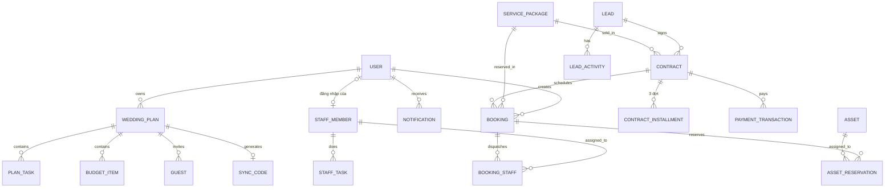

# TÀI LIỆU ĐẶC TẢ TÍNH NĂNG TỔNG QUAN (HIGH-LEVEL PRODUCT SPECIFICATION)
*(Tài liệu dành cho Product Owner (PO) định hướng, thêm mới hoặc điều chỉnh tính năng)*

> 💡 **Lưu ý quy trình:** Khi có thay đổi từ PO tại tài liệu này, vui lòng cập nhật tương ứng vào [Tài liệu Đặc tả Chi tiết Chức năng (Detailed Functional Spec)](detailed_functional_specification.md) trước khi kích hoạt quy trình AI sinh mã nguồn.
>
> 📌 **Phiên bản 1.1** — bổ sung các tính năng Web Admin đánh dấu 🆕 bên dưới (mã chức năng `FN-…` tham chiếu tài liệu chi tiết), cập nhật mô hình dữ liệu và danh mục API theo mã nguồn đã triển khai.

---

## 1. TỔNG QUAN HỆ THỐNG (SYSTEM OVERVIEW)

Hệ thống **Wedding Event Platform** là một giải pháp Monorepo hoàn chỉnh kết hợp giữa:
1. **Ứng dụng Di động Khách hàng & Nhà cung cấp (WedPlanner Mobile App)**: Phục vụ các Cặp đôi (Cô dâu & Chú rể) lên kế hoạch cưới thông minh với sự hỗ trợ của AI, quản lý ngân sách, khách mời và kết nối với các đối tác dịch vụ cưới (Nhiếp ảnh, Trang trí, Trang phục).
2. **Cổng Quản trị Vận hành Studio (Lumière Studios Admin Dashboard)**: Hệ thống Web SaaS nội bộ dành cho các Studio ảnh cưới và Đơn vị tổ chức sự kiện cưới nhằm quản lý CRM, Lịch chụp/thử váy, Hợp đồng điện tử, Kho trang phục & Thiết bị, Phân công nhân sự và Kế toán thu chi.

---

## 2. KIẾN TRÚC MONOREPO & ÁNH XẠ MODULE

```
wedding-event/
├── backend-common/              # Java Spring Boot 4 - Entities, DTOs dùng chung, Repositories, Utils
├── admin-console/
│   ├── backend/                 # Java Spring Boot 4 - API quản trị nội bộ Studio (RBAC Admin/Staff)
│   └── frontend/                # React 18 + TypeScript + Tailwind CSS - Web Dashboard Studio
├── client-console/
│   ├── backend/                 # Java Spring Boot 4 - API ứng dụng di động cho Couple & Vendor
│   └── mobile/                  # Flutter 3 (Dart) - Ứng dụng di động đa nền tảng (iOS & Android)
└── docs/
    └── features/                # Đặc tả nghiệp vụ & User Stories cho AI Coder Agent
```

---

## 3. MÔ HÌNH VAI TRÒ & PHÂN QUYỀN (ACTOR & RBAC)

| Vai trò (Role) | Nền tảng | Mã Role | Quyền hạn chính |
| :--- | :--- | :--- | :--- |
| **Cặp đôi (Couple)** | Mobile App | `ROLE_COUPLE` | Lên kế hoạch cưới, Chat AI sinh ngân sách, quản lý khách mời, đồng bộ bạn đời, tìm kiếm & đặt lịch dịch vụ. |
| **Freelancer / Vendor** | Mobile App | `ROLE_VENDOR` | Nhận yêu cầu báo giá, theo dõi tiến độ dự án, trao đổi tin nhắn trực tiếp với cặp đôi, quản lý gói dịch vụ cá nhân. |
| **Nhân viên Studio (Staff)** | Web Admin | `ROLE_STAFF` | Xem lịch làm việc cá nhân, cập nhật trạng thái lịch hẹn (chụp ảnh, thử váy), giữ lịch & giao/nhận trang phục, chăm sóc khách hàng CRM, xem/gửi hợp đồng, cập nhật tiến độ công việc của mình. |
| **Quản lý Studio (Admin)** | Web Admin | `ROLE_ADMIN` | Toàn quyền kiểm soát Studio: Xem báo cáo doanh thu, tạo/hủy hợp đồng, xuất PDF/Zalo, quản lý giá gói dịch vụ, nhân sự, tài khoản đăng nhập, sổ quỹ thu chi & cài đặt. |
| **Khách hàng của Studio** | Link Zalo (không đăng nhập) | — | Xem hợp đồng, lịch thanh toán & thông tin chuyển khoản qua link công khai có thời hạn, bấm xác nhận đồng ý. |

> Ma trận quyền chi tiết từng thao tác Web Admin: xem **§1.5** tài liệu chi tiết. Nhân viên luôn nhận lỗi 403 (không phải lỗi dữ liệu) khi gọi chức năng chỉ dành cho Quản lý.

---

## 4. ĐẶC TẢ CHI TIẾT TÍNH NĂNG PHÍA MOBILE APP (CLIENT-CONSOLE/MOBILE)
*Nguồn tham chiếu: `wedding_planner_app (1).tsx`*

### 4.1. Onboarding & Xác thực (Auth & Role Selection)
* **Màn hình Splash**: Hiệu ứng chuyển động nhận diện thương hiệu WedPlanner.
* **Đăng nhập đa phương thức**: Hỗ trợ đăng nhập qua Email/Mật khẩu hoặc Google OAuth2.
* **Xác thực OTP 4 số**: Nhập mã xác minh email với giao diện ô nhập tự động chuyển focus.
* **Lựa chọn vai trò (Role Picker)**:
  * *Cô dâu / Chú rể*: Chuyển vào giao diện quản lý cưới cá nhân.
  * *Freelancer / Nhà cung cấp*: Chuyển vào giao diện Dashboard dành cho dịch vụ (Nhiếp ảnh gia, Makeup artist).

### 4.2. Không gian Cặp đôi (Couple Workspace)
* **Dashboard Trang chủ**:
  * Đếm ngược ngày cưới dự kiến và thanh tiến độ hoàn thành kế hoạch cưới (%).
  * Quick Actions 4 nút: `Kế hoạch`, `AI Chat`, `Khách mời`, `Đồng bộ`.
  * Danh sách "Dịch vụ đề xuất": Hiển thị dịch vụ chụp Pre-wedding, Decor tiệc cưới kèm đánh giá sao, địa điểm và mức giá.
* **Quản lý Kế hoạch cưới (Wedding Plan Management)**:
  * **Tab Tổng quan**: Xem ngày tổ chức Đám hỏi, Lễ Cưới, biểu đồ tiến độ ngân sách tổng (Đã chi vs Còn lại).
  * **Tab Công việc (Checklist)**: Phân bổ công việc theo mốc thời gian (Khảo sát địa điểm, Chọn trang phục, Chốt menu...) kèm checkbox hoàn thành.
  * **Tab Ngân sách (Budget Allocation)**: Quản lý ngân sách theo từng danh mục (Nhà hàng, Chụp ảnh, Trang trí, Trang phục), theo dõi số tiền đã cọc và trạng thái thanh toán.
* **Trợ lý Ảo AI (AI Wedding Planner Assistant)**:
  * Chatbot tương tác tự nhiên với người dùng về ngân sách dự kiến, phong cách mong muốn (Hiện đại, Cổ điển, Tối giản).
  * Nút "Sinh Kế Hoạch": Tự động phân bổ số tiền vào các hạng mục chi phí và sinh checklist công việc phù hợp với ngân sách của cặp đôi.
* **Quản lý Khách mời (Guest List & RSVP)**:
  * Thống kê trực quan: `Tổng cộng`, `Đồng ý tham gia`, `Chờ xác nhận`, `Từ chối`.
  * Bộ lọc trạng thái và tìm kiếm nhanh theo tên khách mời.
  * Phân nhóm khách mời: *Gia đình nhà Gái*, *Gia đình nhà Trai*, *Bạn cấp 3*, *Đồng nghiệp*.
* **Đồng bộ hóa với Bạn đời (Couple Sync & Collaboration)**:
  * Tạo mã kết nối ngẫu nhiên 6 ký tự (Ví dụ: `8A9B2C`).
  * Chia sẻ mã hoặc sao chép link liên kết để bạn đời cùng truy cập và chỉnh sửa chung một kế hoạch cưới theo thời gian thực.
* **Khám phá Dịch vụ Cưới (Service Catalog & Booking)**:
  * Tìm kiếm và lọc theo danh mục: Nhà hàng tiệc cưới, Chụp ảnh ngoại cảnh, Trang phục cưới, Hoa & Decor.
  * Màn hình chi tiết dịch vụ: Thư viện hình ảnh, bảng giá, chi tiết gói bao gồm, đánh giá của khách hàng, nút "Liên hệ đặt lịch".

### 4.3. Không gian Đối tác Dịch vụ (Vendor Mobile Workspace)
* **Bảng điều khiển Vendor**: Hiển thị tổng doanh thu tháng, số yêu cầu báo giá mới, điểm đánh giá trung bình (Rating).
* **Quản lý Dự án (Vendor Projects)**: Theo dõi hợp đồng chụp/quay theo trạng thái: *Sắp tới*, *Đang làm*, *Hoàn thành* kèm ngày tổ chức và địa điểm.
* **Hộp thư Tin nhắn (Vendor Chat)**: Nhận phản hồi và trò chuyện trực tiếp với các cặp đôi có nhu cầu thuê dịch vụ.
* **Quản lý Danh mục Dịch vụ (Service Management)**: Tạo mới, cập nhật bảng giá và ẩn/hiện các gói dịch vụ do đối tác cung cấp.

---

## 5. ĐẶC TẢ CHI TIẾT TÍNH NĂNG PHÍA WEB ADMIN (ADMIN-CONSOLE/FRONTEND)
*Nguồn tham chiếu: `lumi_re_studios_admin_dashboard.tsx`*

### 5.1. Dashboard Điều hành Tổng quan (Executive Overview)
* **Thẻ chỉ số KPI cốt lõi**:
  * Doanh thu tháng (so sánh % với tháng trước).
  * Số lượng hợp đồng đang chạy.
  * Khách hàng tiềm năng cần tư vấn (Leads).
  * Tỉ lệ lấp đầy lịch thuê trang phục cưới.
* **Biểu đồ cột Doanh thu**: Thống kê doanh thu theo 12 tháng trong năm kèm tooltip chi tiết.
* **Lịch trình công việc trong ngày**: Hiển thị nhanh các ca chụp Pre-wedding, thử váy, chụp lễ ăn hỏi kèm thợ phụ trách.
* **Phím tắt Quick Action**: Tạo nhanh hợp đồng, thêm lịch hẹn, ghi nhận thu tiền.
* 🆕 **Widget "Công nợ đến hạn"**: các đợt thanh toán sắp đến hạn (3 ngày tới) và quá hạn, bấm để ghi thu ngay. *(FN-ADM-FIN-02)*
* 🆕 **Dashboard Nhân viên**: Nhân viên không xem số liệu doanh thu; trang chủ của họ là lịch hôm nay/7 ngày tới, việc chưa xong và trang phục cần giao/nhận. *(FN-ADM-DASH-03)*

### 5.2. Quản lý Lịch trình Thông minh (Smart Booking Calendar)
* **Chế độ xem linh hoạt**: Hỗ trợ chuyển đổi giữa chế độ *Ngày*, *Tuần*, *Tháng*.
* **Sidebar Lịch tháng**: Đánh dấu ngày có lịch chụp (chấm màu chỉ báo lịch bận).
* **Phân loại lịch hẹn**: Phân màu theo loại sự kiện (*Chụp Pre-wedding*, *Thử váy cưới*, *Chụp phóng sự cưới*, *Lễ ăn hỏi*).
* **Phân bổ nhân sự**: Gán thợ chụp chính, thợ quay phim, thợ trang điểm cho từng ca lịch trình; hệ thống chặn nhân sự trùng giờ và nhân sự đang nghỉ phép.
* 🆕 **Sửa / Hủy lịch hẹn** (Quản lý): dời ngày giờ, đổi nhân sự (kiểm tra trùng lại), hủy kèm lý do — trang phục đã giữ cho lịch được tự trả lại kho. *(FN-ADM-CAL-03)*
* 🆕 **Cập nhật tiến độ tại buổi chụp**: Nhân viên bấm *Khách đã xác nhận → Đang chụp → Hoàn thành* ngay trên điện thoại. *(FN-ADM-CAL-04)*

### 5.3. Quản lý Khách hàng & Hợp đồng (CRM & Contracts)
* **Quy trình Phễu bán hàng (Pipeline Kanban & List View)**:
  * `Mới hỏi (Leads)` -> `Đang tư vấn` -> `Chờ cọc` -> `Đang thực hiện (Hợp đồng)` -> `Đã hoàn thành`.
  * 🆕 Khách không chốt hoặc hủy hợp đồng chuyển sang `Đã mất (Lost)` — ẩn khỏi Kanban, xem bằng bộ lọc.
  * 🆕 Dạng danh sách có phân trang & tìm kiếm; cảnh báo khi nhập SĐT đã tồn tại.
* **Thông tin chi tiết Khách hàng (Slide-over)** 🆕: Lịch sử liên hệ (ghi chú cuộc gọi/Zalo/gặp mặt), gói dịch vụ đã chọn, các hợp đồng & lịch hẹn, tiến độ thanh toán (Tổng tiền, Đã thu, Còn nợ, Quá hạn), trạng thái Zalo, và các nút hành động theo giai đoạn. *(FN-ADM-CRM-02)*
* 🆕 **Hành trình khách hàng liền mạch**: Tạo hợp đồng ngay từ thẻ khách → thu cọc → đặt lịch & giữ trang phục từ hợp đồng → bàn giao → hoàn thành. Giai đoạn khách tự đồng bộ theo hợp đồng, không phải kéo tay. *(FN-ADM-CRM-03)*
* **Vòng đời Hợp đồng** 🆕: `Nháp` → `Đã cọc` → `Đang thực hiện` (đến ngày chụp) → `Hoàn thành` (đã thu đủ **và** đã bàn giao); có thể `Hủy` (kèm hoàn tiền). Hợp đồng chỉ sửa được khi còn Nháp. "Đã thanh toán đủ" là tình trạng thanh toán, không phải trạng thái hợp đồng. *(§1.6, FN-ADM-CONTR-02)*
* 🆕 **Lịch thanh toán 3 đợt & nhắc nợ**: Mỗi hợp đồng có bảng 3 đợt 30% / 50% / 20% với số tiền và hạn cụ thể; tiền thu tự phân bổ vào từng đợt; hệ thống báo trước 3 ngày, đánh dấu quá hạn và (tùy chọn) gửi Zalo nhắc khách. *(FN-ADM-FIN-02)*
* **Mô-đun Xuất Hợp Đồng A4 Điện Tử (Contract Export Engine)**:
  * Xem trước văn bản Hợp đồng dịch vụ cưới chuẩn kích thước giấy in A4 tiêu chuẩn.
  * Tự động điền thông tin Đại diện Bên A (Khách hàng) và Đại diện Bên B (lấy từ Cài đặt studio).
  * Bảng chi tiết dịch vụ, tiến độ thanh toán 3 đợt (số tiền & hạn thực tế), khu vực chữ ký hai bên.
  * **Xuất bản**: Hỗ trợ xuất file PDF tải xuống hoặc tạo link chia sẻ trực tiếp qua Zalo cho khách hàng.
* 🆕 **Trang hợp đồng công khai cho khách**: Link Zalo mở trang `/c/{mã bí mật}` trên điện thoại khách — xem hợp đồng, tải PDF, xem đợt cần thanh toán kèm mã VietQR, bấm "Tôi đồng ý". Link hết hạn sau 30 ngày, Quản lý có thể thu hồi. *(FN-PUB-CONTR-01)*

### 5.4. Quản lý Gói Dịch Vụ Cưới (Packages Management)
* Quản lý các gói chủ lực: *Gói Kim Cương (Ngày Cưới)*, *Gói Tiêu Chuẩn (Pre-wedding)*, *Gói Lễ Ăn Hỏi*.
* Chi tiết quyền lợi trong gói: Số thợ chụp, thợ quay, quy cách album photobook, váy/vest đi kèm, makeup.
* Bật/tắt trạng thái kinh doanh của gói dịch vụ. 🆕 Sửa gói (đổi giá được ghi nhật ký; hợp đồng đã ký giữ nguyên tên & giá cũ). *(FN-ADM-PKG-01)*

### 5.5. Quản lý Kho Trang Phục & Thiết Bị (Wardrobe & Asset Management)
* Phân loại tài sản: *Váy Cưới*, *Vest*, *Thiết bị máy ảnh/ống kính*.
* Trạng thái tài sản: `Sẵn sàng (Available)`, `Đang cho thuê / Đang dùng (In Use)`, `Đang bảo dưỡng / Giặt hấp (Maintenance)`, 🆕 `Thanh lý (Retired)`.
* **Bộ đệm bảo dưỡng (Maintenance Buffer)**: Tự động khóa trang phục thêm 0-30 ngày (thường 1-3 ngày) sau khi khách trả để giặt hấp trước khi cho khách tiếp theo đặt lịch. Kiểm tra cả hai chiều: lượt thuê mới không được rơi vào thời gian giặt hấp của lượt trước, và thời gian giặt hấp của lượt mới cũng không được lấn vào lượt sau.
* 🆕 **Chọn trang phục khi đặt lịch**: Từ lịch hẹn/hợp đồng, mở bộ chọn theo danh mục, size và ngày thuê; món đang bận hiển thị mờ kèm "Bận đến dd/MM"; gợi ý món thay thế khi trùng. *(FN-ADM-ASSET-03)*
* 🆕 **Lịch thuê từng món**: Timeline thời gian thuê + thời gian giặt hấp, hủy giữ lịch. *(FN-ADM-ASSET-03)*
* 🆕 **Giao & nhận trả đồ**: Nhân viên xác nhận khách đã nhận/đã trả, ghi tình trạng (bình thường/cần sửa); trả trễ tự kéo dài thời gian khóa và cảnh báo nếu ảnh hưởng khách tiếp theo. *(FN-ADM-ASSET-04)*

### 5.6. Quản trị Nhân sự & Phân công (Staff Management)
* Quản lý danh sách nhân sự nội bộ và freelancer thân thiết: *Thợ chụp ảnh*, *Thợ quay phim*, *Chuyên viên trang điểm*, *Tư vấn viên (Sales)*.
* Theo dõi số lượng dự án/hợp đồng đã hoàn thành trong tháng của từng nhân viên để tính hoa hồng/lương hiệu quả.
* Giao việc cho nhân sự kèm hạn hoàn thành. 🆕 Sửa thông tin, đánh dấu nghỉ phép (không được phân công lịch mới).
* 🆕 **Tự phục vụ cho nhân viên**: Nhân viên tự xem & đánh dấu hoàn thành việc của mình, xem lịch của mình, giao/nhận đồ — giao diện dùng tốt trên điện thoại. *(FN-ADM-STAFF-03)*

### 5.7. Kế toán & Sổ quỹ Thu Chi (Financials & Cash Flow)
* Ghi nhận dòng tiền:
  * **Khoản thu (Income)**: Thu tiền cọc, thu đợt 2, tất toán hợp đồng khi giao ảnh. Thu vượt công nợ còn lại bị chặn.
  * **Khoản chi (Expense)**: Chi phí in ấn album photobook, thuê xe chụp ngoại cảnh, giặt ủi trang phục, tiền công cộng tác viên, 🆕 hoàn tiền khi hủy hợp đồng.
* Báo cáo cân đối thu chi và lợi nhuận ròng của studio.
* 🆕 **Phiếu không sửa/xóa, chỉ hủy**: Nhập nhầm thì hủy phiếu (bắt buộc lý do, công nợ hợp đồng tự hoàn lại) rồi lập phiếu mới — đảm bảo sổ quỹ minh bạch. Lọc theo khoảng ngày/loại/hợp đồng, phân trang, xuất CSV cho kế toán. *(FN-ADM-FIN-03)*

### 5.8. 🆕 Tài khoản, Thông báo, Tìm kiếm & Cài đặt
* **Quản lý tài khoản đăng nhập** (Quản lý): tạo tài khoản cho nhân viên (gắn với hồ sơ nhân sự), mật khẩu tạm bắt buộc đổi lần đầu, đổi quyền, khóa tài khoản, đặt lại mật khẩu; luôn còn ít nhất 1 Quản lý. Mọi người dùng có *Đổi mật khẩu* và *Đăng xuất* (thu hồi phiên ngay). Sai mật khẩu 5 lần khóa đăng nhập 15 phút. *(FN-ADM-AUTH-04, FN-ADM-USER-01)*
* **Thông báo thông minh**: chuông thông báo theo từng người (nhân viên chỉ nhận việc của mình), bấm vào mở đúng màn hình liên quan. *(FN-ADM-NOTI-01)*
* **Tìm kiếm toàn cục (Ctrl+K)**: tìm khách, hợp đồng, lịch hẹn, trang phục, nhân sự; chọn kết quả sẽ chuyển tới trang và mở chi tiết. *(FN-ADM-SEARCH-01)*
* **Cài đặt studio**: thông tin pháp lý in trên hợp đồng, tài khoản ngân hàng (sinh VietQR), tỉ lệ & thời hạn thanh toán, bật/tắt nhắc nợ qua Zalo, điều khoản chung của hợp đồng. *(FN-ADM-SET-01)*
* **Nhật ký hệ thống** (Quản lý): ai đã làm gì, lúc nào với hợp đồng, phiếu thu chi, tài khoản, giá gói. *(§3.2 tài liệu chi tiết)*

### 5.9. 🆕 Yêu cầu chung (Phi chức năng)
Chi tiết tại **§3** tài liệu chi tiết: tốc độ phản hồi (danh sách < 0,3 giây), sao lưu hằng ngày (mất tối đa 24 giờ dữ liệu, khôi phục trong 4 giờ), tuân thủ quy định bảo vệ dữ liệu cá nhân (ẩn danh khách tiềm năng sau 24 tháng), hỗ trợ bàn phím/trợ năng cơ bản, trình duyệt Chrome/Edge/Safari/Firefox và màn hình điện thoại từ 360px.

---

## 6. MÔ HÌNH DỮ LIỆU DÙNG CHUNG (BACKEND-COMMON DATA MODEL)

### 6.1. Sơ đồ Thực thể Cốt lõi (ERD Entities)


*Bảng đơn lẻ không quan hệ: `studio_settings` (1 dòng), `notifications`, `audit_logs`.*

### 6.2. Đặc tả các trường dữ liệu chính

> Mọi bảng có `created_at`, `updated_at` (TIMESTAMPTZ). Tiền là `NUMERIC(15,0)`. Enum lưu dạng chuỗi. 🆕 = cột/bảng thêm ở v1.1, chưa có trong migration hiện tại. Nguồn chuẩn của schema đã triển khai: `admin-console/backend/src/main/resources/db/migration/`.

1. **User (`users`)**:
   * `id` (UUID, PK), `email` (String, Unique), `password_hash` (String), `full_name` (String), `phone` (String, Nullable), `avatar_url` (String, Nullable), `role` (Enum: `ROLE_COUPLE`, `ROLE_VENDOR`, `ROLE_STAFF`, `ROLE_ADMIN`), `is_active` (Boolean), `is_verified` (Boolean — OTP email, phía mobile), `staff_member_id` (UUID, FK `staff_members`, Nullable — tài khoản Web Admin gắn hồ sơ nhân sự), 🆕 `must_change_password` (Boolean), 🆕 `failed_login_count` (Integer), 🆕 `locked_until` (Timestamp, Nullable), 🆕 `last_login_at` (Timestamp, Nullable). *(Cột `has_plan` của mobile được suy ra từ `wedding_plans`, không lưu.)*
2. **WeddingPlan (`wedding_plans`)**:
   * `id` (UUID, PK), `user_id` (UUID, FK), `partner_id` (UUID, FK, Nullable), `wedding_date` (LocalDate), `engagement_date` (LocalDate, Nullable), `total_budget` (BigDecimal), `completed_percentage` (Integer), `status` (Enum: `PLANNING`, `COMPLETED`).
3. **BudgetItem (`budget_items`)**:
   * `id` (UUID, PK), `wedding_plan_id` (UUID, FK), `category_name` (String), `estimated_amount` (BigDecimal), `actual_amount` (BigDecimal, Nullable), `status` (Enum: `PLANNED`, `DEPOSITED`, `PAID_FULL`).
4. **PlanTask (`plan_tasks`)**:
   * `id` (UUID, PK), `wedding_plan_id` (UUID, FK), `title` (String), `due_date` (LocalDate), `month_group` (String), `is_completed` (Boolean).
5. **Guest (`guests`)**:
   * `id` (UUID, PK), `wedding_plan_id` (UUID, FK), `name` (String), `phone` (String, Nullable), `group_name` (String: *Nhà Trai*, *Nhà Gái*, *Bạn Bè*, *Đồng Nghiệp*), `status` (Enum: `ATTENDING`, `PENDING`, `DECLINED`).
6. **ServicePackage (`service_packages`)** + **`service_package_features`**:
   * `id` (UUID, PK), `vendor_id` (UUID, Nullable - Null nếu là gói của Studio chính), `name` (String), `type` (String: *Pre-wedding*, *Ngày Cưới*, *Lễ Ăn Hỏi*), `price` (BigDecimal ≥ 0), `description` (Text), `thumbnail_url` (String), `is_active` (Boolean).
   * Quyền lợi gói lưu bảng con có thứ tự `service_package_features` (`package_id`, `position`, `feature`), tối đa 20 dòng.
7. **Booking (`bookings`)**:
   * `id` (UUID, PK), `customer_name` (String), `phone` (String, Nullable), `booking_type` (String: *Chụp Pre-wedding*, *Thử váy cưới*, ...), `service_package_id` (UUID, FK, Nullable), 🆕 `contract_id` (UUID, FK, Nullable), 🆕 `lead_id` (UUID, FK, Nullable), `event_date` (LocalDate), `event_time` (LocalTime `HH:mm`), `venue_address` (String), `status` (Enum: `UPCOMING`, `CONFIRMED`, `IN_PROGRESS`, `COMPLETED`, `CANCELLED`), 🆕 `cancel_reason` (String, Nullable).
8. **BookingStaff (`booking_staff`)**: bảng nối `booking_id` + `staff_member_id` (PK kép).
9. **Lead (`leads`)** — khách hàng CRM:
   * `id` (UUID, PK), `name` (String), `phone` (String, có index), `has_zalo` (Boolean), `interest` (String, Nullable — gói/nhu cầu quan tâm), `stage` (Enum: `NEW_LEAD`, `IN_CONSULTATION`, `AWAITING_DEPOSIT`, `IN_PROGRESS`, `COMPLETED`, 🆕 `LOST`).
10. 🆕 **LeadActivity (`lead_activities`)**: `id`, `lead_id` (FK), `channel` (Enum: `CALL`, `ZALO`, `MEETING`, `NOTE`, `SYSTEM`), `content` (String ≤ 1000), `actor_user_id` (FK, Nullable cho sự kiện hệ thống).
11. **Contract (`contracts`)**:
    * `id` (UUID, PK), `contract_number` (String, Unique, `HD-xxx`), `lead_id` (UUID, FK, Nullable), `booking_id` (UUID, FK, Nullable — *giữ để tương thích, quan hệ chính là `bookings.contract_id`*), `customer_name`, `phone`, `has_zalo` (chụp lại tại thời điểm ký), 🆕 `customer_address` (in vào Bên A), `service_package_id` (UUID, FK), `package_name` (String — tên gói tại thời điểm ký), `total_amount` (> 0), `paid_amount` (≥ 0 — *thay cho `deposit_amount` của bản 1.0*), `remaining_amount` (≥ 0, = total − paid), `contract_date` (LocalDate), 🆕 `event_date` (LocalDate), `pdf_file_url` (String, Nullable), `status` (Enum: `DRAFT`, `DEPOSITED`, `IN_PROGRESS`, `COMPLETED`, 🆕 `CANCELLED`), `notes` (String, Nullable), `version` (Long — khóa lạc quan), 🆕 `delivered_at`, 🆕 `cancelled_at`, 🆕 `cancel_reason`, 🆕 `public_token_hash`, 🆕 `share_expires_at`, 🆕 `accepted_at`.
    * Thuộc tính dẫn xuất (không lưu): `paymentStatus` = `UNPAID` | `PARTIAL` | `PAID_FULL` | `OVERDUE`.
12. 🆕 **ContractInstallment (`contract_installments`)**: `id`, `contract_id` (FK), `seq` (1..3, unique cùng `contract_id`), `label`, `percentage`, `amount`, `due_date`, `paid_amount`, `status` (Enum: `PENDING`, `PARTIAL`, `PAID`, `OVERDUE`, `CANCELLED`).
13. **Asset (`assets`)**:
    * `id` (UUID, PK), `code` (String, Unique: *VAY-001*, *MAY-004*), `name` (String), `category` (Enum: `DRESS`, `SUIT`, `CAMERA_EQUIPMENT`), `size` (String, `N/A` nếu không có), `status` (Enum: `AVAILABLE`, `IN_USE`, `MAINTENANCE`, 🆕 `RETIRED` — giá trị *thủ công*; trạng thái hiển thị được suy ra từ lịch giữ đồ), `maintenance_buffer_days` (Integer 0–30).
14. **AssetReservation (`asset_reservations`)** — *bản 1.0 gọi là `ASSET_BOOKING`*:
    * `id` (UUID, PK), `asset_id` (FK), `booking_id` (FK, Nullable), `start_date`, `end_date`, `lock_end_date` (= `end_date + buffer`, hoặc `ngày trả thực tế + buffer` sau khi nhận trả), `status` (Enum: `CONFIRMED`, 🆕 `PICKED_UP`, 🆕 `RETURNED`, `CANCELLED`), 🆕 `picked_up_at`, 🆕 `returned_at`, 🆕 `return_condition`. Ràng buộc `end_date ≥ start_date` và `lock_end_date ≥ end_date`; index (`asset_id`, `start_date`, `lock_end_date`).
15. **PaymentTransaction (`payment_transactions`)**:
    * `id` (UUID, PK), `code` (String, Unique, `TRX-xxx`), `contract_id` (UUID, FK, Nullable), `amount` (> 0), `type` (Enum: `INCOME`, `EXPENSE`), `category` (String), `description` (String), `transaction_date` (LocalDate), 🆕 `voided_at`, 🆕 `voided_by`, 🆕 `void_reason`.
16. **StaffMember (`staff_members`)**: `id`, `code` (Unique, `NV-xxx`), `full_name`, `position` (*Thợ Chụp Chính*, *Makeup*, *Sales*...), `phone`, `work_status` (Enum: `WORKING`, `ON_LEAVE`).
17. **StaffTask (`staff_tasks`)**: `id`, `staff_member_id` (FK, xóa theo nhân sự), `title`, `due_date`, `notes` (Nullable), `completed` (Boolean).
18. **Notification (`notifications`)**: `id`, `title`, `description`, `is_read` (Boolean), 🆕 `recipient_user_id` (FK, Nullable = mọi Admin), 🆕 `link` (String, Nullable). *(v1.1: trạng thái đã đọc theo từng người — khi có `recipient_user_id`.)*
19. **StudioSettings (`studio_settings`)** — đúng 1 dòng `id = 1`: `name`, `address`, `tax_code`, `legal_representative`, `bank_info`, 🆕 `bank_bin`, 🆕 `bank_account_number`, 🆕 `bank_account_name`, 🆕 `payment_schedule` (JSON, mặc định `[30,50,20]`), 🆕 `delivery_days` (mặc định 30), 🆕 `booking_slot_minutes` (Nullable), 🆕 `zalo_payment_reminder` (Boolean), 🆕 `require_full_payment_before_delivery` (Boolean), 🆕 `contract_terms_template` (Text).
20. 🆕 **AuditLog (`audit_logs`)**: `id`, `actor_user_id`, `action`, `entity_type`, `entity_id`, `before` (JSONB), `after` (JSONB), `ip`, `created_at` — chỉ thêm, không sửa/xóa.
21. **Sequences**: `staff_code_seq` (NV-001), `contract_number_seq` (bắt đầu 102 → HD-102), `transaction_code_seq` (TRX-001).

*Refresh token Web Admin lưu ở Redis (`admin:refresh:{userId}:{jti}`, TTL 30 ngày), không lưu DB.*

---

## 7. ĐẶC TẢ RESTFUL API ENDPOINTS

> Định tuyến qua Nginx Gateway: xem §1.4 tài liệu chi tiết. `/api/v1/auth/**` và `/api/v1/client/**` → `client-console/backend`; `/api/v1/admin/**` và `/api/v1/public/**` → `admin-console/backend`.

### 7.1. Module Xác thực Mobile (`/api/v1/auth`)
* `POST /api/v1/auth/login`: Đăng nhập với email & password.
* `POST /api/v1/auth/google`: Đăng nhập với Google ID Token.
* `POST /api/v1/auth/send-otp`: Gửi mã OTP kích hoạt tài khoản.
* `POST /api/v1/auth/verify-otp`: Kiểm tra tính hợp lệ của mã OTP.
* `GET /api/v1/auth/me`: Lấy thông tin user hiện tại.
* `PUT /api/v1/users/role`: Chọn vai trò sau đăng ký (Couple / Vendor).
* `PUT /api/v1/users/me`: Cập nhật hồ sơ cá nhân (họ tên, email, SĐT).

### 7.2. Module Kế hoạch Cưới & Khách mời phía Couple (`/api/v1/client`)
* `GET /api/v1/client/plans/my-plan`: Lấy thông tin kế hoạch cưới hiện tại của cặp đôi.
* `POST /api/v1/client/plans`: Tạo mới kế hoạch cưới với ngân sách và danh mục ban đầu.
* `POST /api/v1/client/plans/ai-generate`: Gọi Custom In-House AI Model sinh kế hoạch và phân bổ chi phí dựa trên yêu cầu văn bản.
* `POST /api/v1/client/plans/sync-code`: Tạo mã kết nối bạn đời.
* `POST /api/v1/client/plans/join-sync`: Nhập mã kết nối để đồng bộ kế hoạch cưới.
* `GET /api/v1/client/guests`: Lấy danh sách khách mời (có hỗ trợ filter status/group).
* `POST /api/v1/client/guests`: Thêm khách mời mới.
* `PUT /api/v1/client/guests/{id}`: Cập nhật thông tin/trạng thái RSVP của khách.
* `PATCH /api/v1/client/plans/tasks/{taskId}`: Tick hoàn thành / bỏ tick một công việc trong checklist.
* `GET /api/v1/client/services`: Danh mục tìm kiếm dịch vụ dành cho couple.
* `GET /api/v1/client/services/{id}`: Chi tiết một dịch vụ.
* `GET /api/v1/client/notifications`, `PATCH /api/v1/client/notifications/{id}/read`: Hộp thư thông báo trong app.
* `POST /api/v1/messages/send`: Gửi tin nhắn cho Studio/Vendor (kèm WebSocket `/ws`).

### 7.3. Module Quản trị Studio (`/api/v1/admin`)
Quyền: **A** = chỉ `ROLE_ADMIN`; **A/S** = cả Quản lý và Nhân viên (Nhân viên có thể bị giới hạn "của mình", xem §1.5). ✅ đã triển khai, 🆕 mới ở v1.1.

| Nhóm | Endpoint | Quyền | Mã chức năng |
| :--- | :--- | :---: | :--- |
| Xác thực | ✅ `POST /auth/login`, `POST /auth/refresh`, `GET /auth/me` | Public / A/S | FN-ADM-AUTH-01..03 |
| | 🆕 `POST /auth/logout`, `POST /auth/logout-all`, `POST /auth/change-password` | A/S | FN-ADM-AUTH-04 |
| Tài khoản | 🆕 `GET/POST /users`, `PATCH /users/{id}`, `POST /users/{id}/reset-password` | A | FN-ADM-USER-01 |
| Dashboard | ✅ `GET /dashboard/stats`, `GET /dashboard/revenue-chart?year=` | A | FN-ADM-DASH-01/02 |
| Lịch hẹn | ✅ `GET /bookings/calendar?view=day\|week\|month&date=&staffId=`, `POST /bookings` | A/S | FN-ADM-CAL-01/02 |
| | 🆕 `GET /bookings/{id}`, `PUT /bookings/{id}`, `POST /bookings/{id}/cancel` | A (xem: A/S) | FN-ADM-CAL-03 |
| | 🆕 `PATCH /bookings/{id}/status` | A/S | FN-ADM-CAL-04 |
| Gói dịch vụ | ✅ `GET /packages` (A/S), `POST /packages`, `PATCH /packages/{id}/active` (A) · 🆕 `PUT /packages/{id}` (A) | | FN-ADM-PKG-01 |
| Kho | ✅ `GET /assets?category=`, `GET /assets/conflicts`, `POST /assets/booking` (A/S), `POST /assets` (A) | | FN-ADM-ASSET-01/02 |
| | 🆕 `PUT /assets/{id}`, `PATCH /assets/{id}/status` (A) · `GET /assets/availability`, `GET /assets/{id}/reservations`, `POST /assets/reservations/{id}/cancel` (A/S) | | FN-ADM-ASSET-02/03 |
| | 🆕 `POST /assets/reservations/{id}/pickup`, `POST /assets/reservations/{id}/return`, `GET /assets/handover?date=` | A/S | FN-ADM-ASSET-04 |
| Nhân sự | ✅ `GET /staff` (A/S), `POST /staff` (A), `GET/POST /staff/{id}/tasks`, `PATCH/DELETE /staff/tasks/{taskId}` (A) | | FN-ADM-STAFF-01/02 |
| | 🆕 `PUT /staff/{id}`, `PATCH /staff/{id}/work-status` (A) · `GET /me/tasks`, `PATCH /me/tasks/{id}` (A/S) | | FN-ADM-STAFF-01/03 |
| CRM | ✅ `GET /crm/pipeline`, `POST /crm/customers`, `PATCH /crm/customers/{id}/stage` | A/S | FN-ADM-CRM-01 |
| | 🆕 `GET /crm/customers?page&stage&q`, `GET/PUT /crm/customers/{id}`, `POST /crm/customers/{id}/activities` (A/S), `DELETE /crm/customers/{id}` (A) | | FN-ADM-CRM-01/02 |
| Hợp đồng | ✅ `GET /contracts`, `GET /contracts/{id}/preview-html`, `GET /contracts/{id}/export-pdf`, `POST /contracts/{id}/share-zalo` (A/S), `POST /contracts` (A) | | FN-ADM-CONTR-01/02 |
| | 🆕 `PUT /contracts/{id}`, `POST /contracts/{id}/cancel`, `POST /contracts/{id}/deliver`, `POST /contracts/{id}/revoke-link`, `PUT /contracts/{id}/installments` (A) · `GET /contracts/{id}/installments` (A/S) | | FN-ADM-CONTR-02, FIN-02 |
| Sổ quỹ | ✅ `GET /financials/transactions`, `GET /financials/summary`, `POST /financials/transactions` | A | FN-ADM-FIN-01/03 |
| | 🆕 `POST /financials/transactions/{id}/void`, `GET /financials/export`, `GET /financials/receivables` | A | FN-ADM-FIN-02/03 |
| Thông báo | ✅ `GET /notifications`, `PATCH /notifications/{id}/read`, `PATCH /notifications/read-all` | A/S | FN-ADM-NOTI-01 |
| Tìm kiếm | ✅ `GET /search?q=` | A/S | FN-ADM-SEARCH-01 |
| Cài đặt | ✅ `GET /settings/studio` (A/S), `PUT /settings/studio` (A) | | FN-ADM-SET-01 |
| Nhật ký | 🆕 `GET /audit-logs` | A | §3.2 |

### 7.4. 🆕 Trang công khai cho khách (`/api/v1/public`) — không đăng nhập, có rate-limit
* `GET /api/v1/public/contracts/{token}`: Xem hợp đồng, lịch thanh toán, thông tin chuyển khoản.
* `GET /api/v1/public/contracts/{token}/pdf`: Tải PDF hợp đồng.
* `POST /api/v1/public/contracts/{token}/accept`: Khách xác nhận đồng ý hợp đồng.

---

## 8. TIÊU CHUẨN THIẾT KẾ UI/UX (DESIGN SYSTEM)

* **Bảng màu Mobile (WedPlanner)**:
  * Primary Brand: Hồng & Đỏ hoa hồng (`Rose-500 #f43f5e`, `Pink-600 #db2777`).
  * Secondary / Background: Slate sáng (`Slate-50 #f8fafc`, Card `White #ffffff`).
  * Text: `Slate-800` (Tiêu đề), `Slate-500` (Phụ đề).
  * Status Colors: Thành công (`Emerald-500`), Chờ duyệt (`Amber-500`), Hủy (`Red-500`).
* **Bảng màu Web Admin (Lumière Studios)**:
  * Primary Accent: Đỏ Ruby / Rose cá tính (`Rose-600 #e11d48`, hover `Rose-700 #be123c`).
  * Neutral Sidebar & Header: Slate tối (`Slate-900`) hoặc Trắng Slate (`Slate-100` viền `Slate-200`).
  * Layout: Sidebar cố định bên trái (collapse responsive trên mobile), Header cố định chứa thanh tìm kiếm Global (Ctrl+K) và chuông thông báo thông minh.

---

## 9. CHỈ DẪN SINH MÃ NGUỒN CHO AGENT (AGENT CODE GENERATION GUIDELINES)

Khi sinh mã nguồn cho hệ thống này:
1. **Module `backend-common`**: Đặt các Model/Entity JPA (Jakarta Persistence, Spring Boot 4.x), Enums (`Role`, `BookingStatus`, `ContractStatus`, `LeadStage`, `ReservationStatus`, `InstallmentStatus`, ... — giá trị theo §1.6 tài liệu chi tiết), Repository Interfaces (mỗi interface một file, không lồng trong class khác) và Base Response DTOs.
2. **Module `admin-console/backend`**: Cung cấp Controller/Service Spring Boot 4 xử lý cho Web Admin với tiền tố URL `/api/v1/admin/**` (gồm xác thực `/api/v1/admin/auth/**`) và trang công khai `/api/v1/public/**`. Cấu hình Spring Security 7/Spring Boot 4 yêu cầu `ROLE_ADMIN` hoặc `ROLE_STAFF`, phân quyền chi tiết theo §1.5 tài liệu chi tiết. Thay đổi schema bằng Flyway migration mới.
3. **Module `admin-console/frontend`**: Viết mã nguồn React 18 + TS sử dụng Lucide React icons, Tailwind CSS, chia components rõ ràng theo từng Tab màn hình tương tự như template `lumi_re_studios_admin_dashboard.tsx`.
4. **Module `client-console/backend`**: Cung cấp Controller/Service Spring Boot 4 xử lý cho Mobile App với tiền tố URL `/api/v1/client/**` và `/api/v1/auth/**`.
5. **Module `client-console/mobile`**: Viết mã nguồn Flutter (Dart) theo kiến trúc Feature-based, quản lý State rõ ràng, xây dựng các màn hình tương tự template `wedding_planner_app (1).tsx`.
